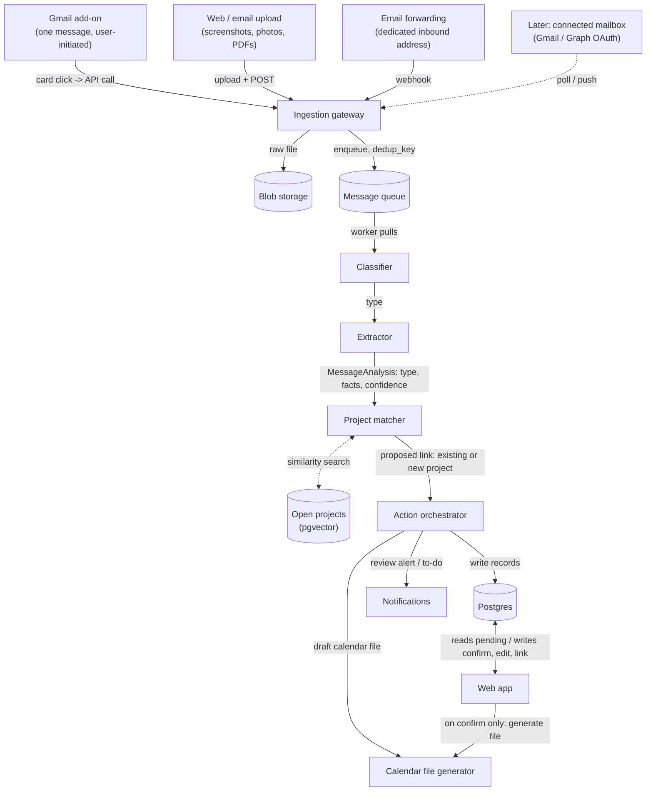
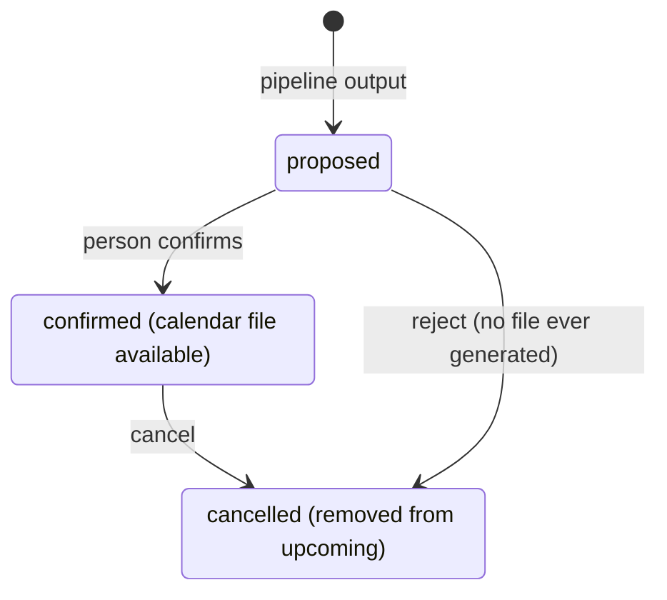
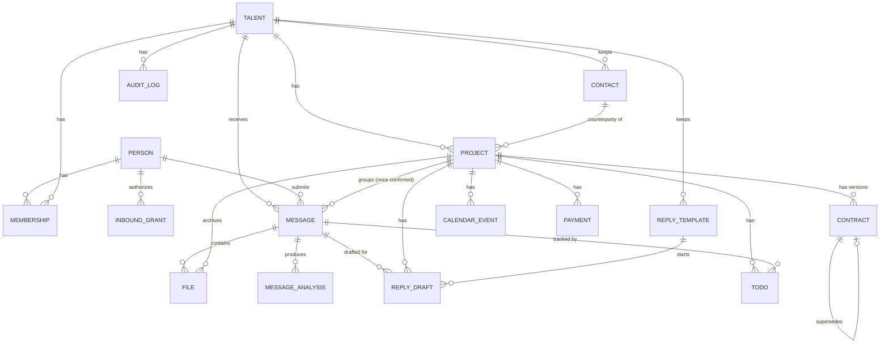

# Architecture

A business operating layer for independent talent: musicians, influencers, models, and the people who manage them. The system ingests the messages a talent's business runs on — gig offers, brand deals, contracts, payment terms — reads what they say, tracks each ongoing deal as one thing even as it evolves across multiple messages and contract versions, and surfaces a dashboard of what's active, what's next, and what needs a decision.

The core mechanism is the same regardless of who's using it: a message comes in, the system reads it, proposes what it means, and a person confirms before anything is recorded as fact or written to a calendar. Everything below exists to support that loop reliably across many message types, many deals, and eventually many kinds of talent.

Scope here is grounded in interviews with two real prospective users — a talent manager and an independent creator — not just assumption. Where their stated needs shaped what's here, it's noted inline.

## Table of contents

- [Functionality](#functionality)
- [Roles and verticals](#roles-and-verticals)
- [Ingestion](#ingestion)
- [Understanding and project matching](#understanding-and-project-matching)
- [Pipeline](#pipeline)
- [Entity model](#entity-model)
- [Schema](#schema)
- [Stack](#stack)
- [Internationalization](#internationalization)
- [Splitting the monolith later](#splitting-the-monolith-later)
- [Open questions](#open-questions)

## Functionality

Tagged by when it's built: **MVP** ships first. **Phase 2** follows once the core loop is validated. **Later** is designed for here but not built yet.

### Onboarding and identity

- The app in Traditional Chinese (`zh-TW`) and English (`en`), switchable per person; more languages later without code changes — **MVP**. See [Internationalization](#internationalization).
- Sign up and choose a vertical: music artist, influencer, model, or other — **MVP**. Only music is populated with real extraction fields at first; the choice itself, and the framework behind it, ships from day one.
- Choose account type: an individual managing their own career — **MVP**, or a manager/agency managing several talents — **Later**.
- Dashboard labels and extraction fields tailored to the chosen vertical — **Phase 2**. Needs real data from a second vertical first.

### Ingestion

- Gmail add-on: open an email in Gmail, click one button to send just that message in — **MVP**.
- Upload a screenshot, photo, or PDF from a browser, including several images from one scrolling conversation — **MVP**.
- Paste an offer's text directly (匯入邀約) — **MVP**. It becomes a message and goes through the same analysis.
- Email a screenshot to a personal upload address as a phone-friendly alternative to the web upload page — **MVP**.
- Forward an email to a dedicated inbound address — **MVP alternative path**. Needs no Google authorization or review at all, and works with any email provider, not just Gmail. Weaker on two fronts: forwarding changes the message headers, so recovering the original sender and timestamp for deal-matching is less reliable than reading via API, and there's no natural UI slot for project tagging the way the add-on's dropdown provides.
- Connect a Gmail account directly so the system reads new mail on its own, no per-message action needed — **Later**. Real access to the whole mailbox, designed for now, built when the per-message flow proves too much friction.
- Other email providers via forwarding — **Later**.

### Reading and understanding

- Classify each message: gig or event offer, contract, payment note, or other — **MVP**.
- Extract the core facts: counterparty, what it's about, date, money, payment method, reply-by deadline — **MVP**.
- Read screenshots and photos as conversations, not single documents — who said what, in what order — **MVP**.
- Read PDF and image attachments, such as a contract or a rider — **MVP**.
- Show contract terms as stated, without judging them — **MVP**.
- Vertical-specific fields — usage rights and exclusivity windows for a brand deal, guarantee versus door split for a music gig — **Phase 2**.
- Guidance on contract language, royalty structures, or red flags — **Later**. Needs a legal or rights specialist involved before it's built at all.

### Projects, not messages

A **project** (UI: 專案) is the unit a person manages: one ongoing deal with one counterparty. Messages, contract versions, calendar events, money, and to-dos all belong to a project.

- Group the messages and contract versions that belong to one ongoing deal into a single project — **MVP**.
- Track each project through stages — offer, negotiating, signed, in progress, collecting payment, closed, or declined / cancelled. The system suggests a stage change; the person confirms it or sets the stage by hand — **MVP**.
- Project types, each with its own fields, screens, milestones, and to-dos. The registry lists 演出 `gig`, 品牌合作 `brand_deal`, 業配 `sponsored_post`, 授權 `licensing`, and 其他 `other` from the MVP, each with its "what to confirm" checklist; `gig` gets full fields and AI extraction in the **MVP**, the others in **Phase 2**; further types as research shows a need — **Later**.
- Archive and restore projects, contacts, payments, templates, drafts, and files — **MVP**. Archiving hides; deleting removes.
- Match a new message to an existing project automatically, and always ask the person to confirm the match — **MVP**.
- Detect that a new message is an updated version of an existing contract, and show exactly what changed — fee, dates, terms — **MVP**.
- Manually merge or split projects when the automatic match is wrong — **MVP**, basic version; refined once real usage shows where it fails.

### Quoting and drafting

- Analyze each message: a summary, the extracted facts, what the sender is asking for, and what's missing (e.g. no load-in time) — **MVP**.
- Draft a reply, quote, or payment follow-up — several versions at once — for the person to review and send themselves — **MVP**. Validated as the single most requested capability in interviews; the system never sends on its own. Drafts are stored, along with which one the person picked and how they edited it.
- A reply library: reusable templates with placeholders (`{{合作方}}`, `{{報價}}`…) and past replies kept for reference, per project type — **MVP**. Useful without AI, and later the examples AI drafts from.
- Quotes and payments carry a tax rate and whether the entered amount includes tax; tax-inclusive and tax-exclusive amounts are shown side by side — **MVP**. Taiwan's 5% business tax appears on most quotes.
- An assistant that answers questions over the person's own data ("what's due tomorrow?", "how much is unpaid?") — **Later**. The screen ships as a placeholder.
- Draft against the person's own past phrasing and process, not a generic template — **Phase 2**. Needs enough confirmed history per person to draw from.

### Review and action

- A review queue — nothing is recorded as fact, drafted, or scheduled without a person confirming it — **MVP**.
- An in-app calendar of events and deadlines across projects, filterable to one project — **MVP**.
- A downloadable calendar file for a confirmed event — **MVP**.
- A private calendar subscription link, so confirmed events appear in Google or Apple Calendar with no account connection — **MVP**.
- Google Calendar sync: our events pushed to a dedicated Google calendar in near-real time, then the person's chosen Google calendars shown here read-only — **Phase 2**, in progress; phases, permission, and ownership in [decision 0009](decisions/0009-google-calendar-sync.md), Google setup in [docs/setup/google-calendar.md](setup/google-calendar.md).
- To-dos generated from extracted deadlines: reply by Friday, deposit due Oct 1, review this changed contract — **MVP**. To-dos are also how a message is tracked: its "to respond" / "waiting for reply" state is read from the to-dos linked to it, since the system never sees the person's own replies.
- Direct calendar account connection, so confirmed events appear without a download step — **Phase 2**.

### Billing and payments

- Track a project's payment status against extracted amounts and due dates — deposit paid, balance outstanding, overdue — **MVP**. The amount actually received is recorded separately from the amount agreed, since withholding tax and the supplementary health-insurance premium (二代健保) often make them differ.
- Record expenses by hand — amount, label, and optionally a project — and show net per project — **MVP**. No receipts, categories, or reports.
- Split a quote into deposit and balance payments in one step — **MVP**.
- A project-level settlement check: quoted vs. billed vs. received, open to-dos, unpaid costs — **MVP**.
- Void (作廢) a mistaken or duplicate payment entry: it drops out of every total and chart but stays viewable and restorable — **MVP**. Payments have no archive: past months need no hiding, they're just a date filter.
- Finance views: money still to pay, the last six months of cash in and out, overdue-income aging, and signed-contract totals — **MVP**.
- Subscription plans and billing for the product itself — **Later**. Kept entirely separate from a talent's project payments.
- Amounts in TWD only — **MVP**. Each amount still carries its currency.
- Multiple currencies, with a per-user default currency the dashboard converts into — **Later**. See [Multi-currency](#multi-currency-later).
- A running record of which counterparties pay late and by how much — **Later**. Needs enough payment history per counterparty to be meaningful.

### Analytics and insights

- Income breakdown by source — gigs, brand deals, licensing — **Later**.
- Streaming or platform performance data (e.g. Spotify) alongside deal and release activity — **Later**. A separate data integration, not derived from messages.
- Basic bookkeeping and profit/loss summaries — **Later**. Explicitly excluded from MVP; this is accounting software, not a lighter version of it.
- Return on a deal or a piece of content — income against production and promotion cost — **Later**.

### Dashboard

- A list of projects: counterparty, status, next key date — **MVP**.
- Per-project detail: the timeline of messages and versions, current terms, open to-dos — **MVP**.
- Concrete urgency signals validated in interviews: expected income in the next 30 days, deliverables and signatures pending, a contract that doesn't match its offer, unconfirmed travel or venue logistics, overdue payments — **MVP**.
- A single view across every talent a manager or agency represents — **Later**.
- Search across projects, contacts, calendar, and templates (⌘K) — **MVP**.
- In-app notifications derived from upcoming to-dos, events, and payments due to be received or paid — **MVP**. Ordered by urgency (within the next two hours, overdue, today, later); read state and "remind me in an hour" are saved per person — **MVP**. Background push (browser, email) — **Later**.

### Contacts

- A contact list of artists, counterparties, and managers — name, company, email, phone, notes — linked to projects — **MVP**. A project keeps the counterparty's name as text too, so a project without a contact still works; a draft takes its recipient from the linked contact.
- Partner history (合作紀錄): per counterparty contact, the number of signed projects, on-time payment rate, average days late, and overdue money still owed — **MVP**. Computed from projects linked to the contact and their income payments; same name never implies same contact. It's a record, not a credit score. Signed projects count even once archived (they're history); negotiations, voided entries, and costs don't; a deposit and a balance are two payments.
- Finance additions — **MVP**: a to-pay card beside received / outstanding / paid; contract totals for live signed projects (independent of the date filter; unset quotes listed separately); outstanding income by age (not yet due, 1–30 days late, 31+, no due date); six months of cash in and out by settled date.

### Files

- A file archive per project — contracts, assets, invoices — uploaded directly, alongside the files that arrived with messages — **MVP**.

### Accounts, access, and security

- Sign in with email and password, or with Google; both are sign-in methods on the same person. A first Google sign-in links to an existing person only when both sides have verified the email; a different email links from settings while signed in. Signing in with Google never grants mailbox access — **MVP**. See [decision 0001](decisions/0001-sign-in-methods-and-account-linking.md).

- Every connected account shows what it will read and do before the person approves it, and can be disconnected at any time, stopping all further access — **MVP**.
- Message content sent to the model is never used to train it, and is handled through the API's standard abuse-monitoring retention, not stored by us beyond what's needed to serve the product — **MVP**.
- Field-level masking and finer access control for sensitive financial data, once serving larger agencies with data they consider confidential — **Later**.

### Bands and collaboration

- Shared access for a band or team, with scoped roles for a session player, lawyer, or bookkeeper — **Later**.

## Roles and verticals

Vertical and account type are independent axes, set separately at onboarding. A manager can represent talents across different verticals; a solo model and a solo musician use the same account type with different extraction fields.

| Axis | Values | What it changes |
|---|---|---|
| Vertical | Music artist, influencer, model, video (videographer / filmmaker), other | Which extraction fields apply beyond the core set, and which labels the dashboard uses |
| Account type | Individual, manager, agency | Whether one `Talent` or many are attached to the person's account, and who can see what |

Onboarding asks a single question — "what's your role?" — with six cards: 音樂人 (musician), 經紀人 (manager), 影像工作者 (videographer / filmmaker), Influencer, Model, 其他 (other). The answer is saved onto these two axes, not as a third field: 經紀人 sets `account_type = manager`; every other card sets `vertical`. A manager picks the vertical of the talent they're setting up. Choosing 經紀人 is allowed now and still manages one talent until multi-talent accounts ship (Later). The role is a working preference shown in the UI and can be changed in settings; it never grants or limits access — permissions come from `membership.role`.

Each person also picks how the assistant character looks — female, male, or non-binary (`person.avatar_appearance`). It's purely presentational.

Every extraction schema starts from the same core: who the counterparty is, what the message is about, when, how much money, how it's paid, and any reply-by deadline. A vertical adds fields on top of that core rather than replacing it — a brand deal still has a date and a payment, it also has deliverables and a usage window.

## Ingestion

The first version never scans a mailbox in the background. Every message arrives because a person acted: they clicked a button on an email they had open, forwarded a message, or uploaded a file. That has a real engineering upside — there's no unknown-sender case to guard against, because the source of every message is always the authenticated person themselves, not a claim in an email header.

### Gmail add-on

- A Google Workspace Add-on registers a contextual card in Gmail. While a person has a message open, the card shows a button to send it in.
- Clicking it calls our HTTP endpoint with the open message's id and an authorization scoped to that message only — not the mailbox.
- Our backend calls the Gmail API with that authorization to fetch the one message — body and attachments — and hands it to the same pipeline an upload would go through.
- Authorization happens once, at add-on install, and is stored as one row per person. No polling, no watch subscription, no background job.
- Before sending, the card can show a dropdown of the user's existing projects (plus an option to create a new one), so the message is filed under the right deal on the way in. This removes a meaningful chunk of the deal-matching problem for anything that comes through this channel — the person is telling the system directly, rather than the system inferring it.

> **Confirm before building:** as I understand it, a Gmail add-on scoped to the current message sits in a lighter review tier than full mailbox access, but Google's review requirements shift — check the current Workspace Add-ons documentation before committing engineering time to the submission process.

### Email forwarding

- A person forwards a relevant email to a dedicated address (e.g. `you@in.talentbusinessos.com`), or sets up a one-time auto-forward rule in Gmail so future mail forwards automatically.
- Needs no Google authorization or review at all, and works with any email provider — the mechanism is just "the user sends mail to an address we control."
- Forwarding rewrites the message: the original sender and timestamp end up embedded in the forwarded body rather than in clean headers, so recovering them for deduplication and deal-matching needs extra parsing and is less reliable than reading the original via an API.
- No native UI for project tagging — would need a convention (e.g. a tag in the subject line) or a follow-up step on a web page.

### Screenshots and uploads

- A web upload page takes screenshots, photos, and PDFs — drag and drop on desktop, file picker or camera roll on mobile. Files go straight to blob storage through a presigned URL, then a short call registers the upload as a message.
- Several images uploaded together are treated as one conversation. The extractor reads them in the order they were uploaded and reconstructs who said what.
- A personal email-in address covers the case where uploading from a phone's share sheet isn't available.
- Relative dates in a screenshot ("Friday," "tomorrow") resolve against a timestamp visible in the image where there is one, falling back to upload time. The review screen always shows the resolved date, not the original phrase.
- **Built:** 上傳截圖／PDF in the inbox takes up to 10 files, 10 MB each and 12 MB in total (they go to the model inline, base64-encoded, within a 20 MB request) — PNG, JPEG, WebP, HEIC, PDF — in an order the person can change. The browser `PUT`s each file to storage through a signed URL (`lib/storage`, ten minutes, bound to the declared type and size) under a key scoped to the talent (`files/{talent_id}/{file_id}`); `registerUpload` then checks each file arrived with that size, type, and matching file signature (a renamed text file isn't a PNG), fingerprints the bytes in order (`dedup_key`, so the same screenshots twice open the existing message), and records the message (channel `upload`) and its `file` rows. The analysis reads the files inline with the prompt and also returns a transcript of what it read, shown as "AI 讀到的內容" beside the thumbnails. Files are served only through `/api/files/[id]`, which checks the signed-in talent and sends the stored type with `nosniff`. Not yet: the email-in address; cleanup of files uploaded but never registered (an abandoned dialog); HEIC thumbnails (the file opens, the inbox shows a tile).

### Designed for later: a connected mailbox

- Gmail API and Microsoft Graph over OAuth 2.0, one refresh token per mailbox. Poll on an interval to start; push (a Gmail `watch` on Pub/Sub, or a Graph subscription) once latency matters.
- This is a materially bigger authorization to ask for — the full mailbox, not one message — and past a small number of users it needs Google's app verification and a security assessment, which can take weeks.
- It also reopens a problem the per-message design avoids: a connected mailbox can receive mail addressed to more than one project or, for a manager, more than one talent, so it needs a routing step the add-on flow doesn't.
- Continuous mailbox monitoring (polling or a maintained push subscription) is a standing background cost that runs even when nothing's happening, scaling with total user count — a real, durable difference from the add-on's zero-idle-cost model.

> **Message content is untrusted input regardless of channel.** The extractor returns schema-validated data and has no tools of its own, so nothing inside a message can trigger an action by itself. Invisible characters are stripped before analysis; the model and deterministic checks flag injected instructions, payment-detail requests, hidden text, and inconsistencies, shown as a warning in the inbox. Every write — a confirmed event, a saved contract — happens only after a person confirms it in the review queue. The layers, and the rules future features must keep (never act on model output without a person; drafts never carry payment details from the incoming message), are in [decision 0007](decisions/0007-untrusted-message-content.md).

## Understanding and project matching

Analysis turns a message into facts. Matching decides which project those facts belong to. These are separate steps, and the second one is the harder engineering problem.

### Analysis

- One model call, forced into a schema rather than free text, labels the message and pulls out the core fields plus the fields for its project type and intent (`lib/ai/analysis.ts`).
- **Two labels, from registries.** The *intent* is what the message is doing — inquiry, negotiation, confirmation, contract, logistics, payment, cancellation, other (`lib/ai/extraction/intents.ts`) — and decides what filing it should do. The *project type* is what the work is (`lib/project-types`). Each defines its own fields; the prompt and the schema are generated from those definitions, so adding a type or a field is a definition plus its labels, checked by `npm run i18n:check`. Core fields (parties, dates, money, payment terms, reply-by, asks, missing) apply to every message. Each value carries the exact words it came from, shown under it in the inbox.
- **Prompts are code** (`lib/ai/prompts.ts`): general rules plus the registry definitions, with the week's calendar written out for relative dates. A fingerprint of the prompt and definitions is stored with every analysis (`message_analysis.prompt_version`) beside the model, so results can be compared across changes.
- **Evals** (`evals/`, `npm run eval:extraction`) score extraction against made-up cases with known answers, through the same function the app uses; run them before and after changing a prompt, field, or model. Classifying and extracting can split into two calls later if a cheap triage step pays off. The model sits behind one seam (`lib/ai/model.ts`): a free local model in development, Claude for production — see [decision 0006](decisions/0006-model-provider.md).
- Beyond the facts, the analysis records a short summary, what the sender is asking for, and what's missing (no start time, no deposit terms) — the drafter uses the last two directly.
- Images (screenshots, photos, rendered PDF pages) go through the same extractor using a vision-capable model call rather than a separate OCR step.
- Every analysis is stored with the model version and a confidence score, versioned per message rather than overwritten — re-running it later doesn't lose the earlier attempt.
- **Every model call is logged** in `ai_call` (task, provider and model, prompt version, tokens, latency, status or failure code, and the talent, person, and message it ran for). It feeds usage limits, cost tracking, and debugging — [decision 0008](decisions/0008-ai-operations.md).
- **Usage limits** count real calls in `ai_call` over the last 24 hours: analyses per account per day (`AI_DAILY_ANALYSES`) and per message (`AI_MAX_ANALYSES_PER_MESSAGE`). Over a limit, a message is saved but not sent to the model (failure `usage_limit`); the inbox shows what's left today.
- **Recorded responses** for tests: `AI_REPLAY=record` saves each model answer under a key of the prompt version, the input, the schema, and the files; `AI_REPLAY=only` answers from recordings and fails (`replay_missing`) rather than calling a live model. Recordings live in `AI_RECORDINGS_DIR` (not committed), are marked `replayed` in `ai_call`, and don't count toward limits. Off in production.
- **Pasted offers (built).** 匯入邀約 stores the text as a `message` (channel `paste`, duplicate pastes return the existing message), analyzes it in the background (`after()`, status `pending` → `analyzed` or `error` with a retry), and shows the proposal in the inbox beside the original text. Filing it either creates a project — the form prefilled from the analysis, stage 待確認 — or adds it to an existing project; either way the reply-by date is shown for the person to confirm before it becomes a `reply` to-do linked to the message (`todo.message_id`). The project's Offer section shows the earliest message filed under it.

### Matching a message to a project

A deal is rarely one message. A venue's first offer, the signed contract, and a follow-up about the deposit date are the same deal told three times. The system needs to recognize that without ever silently merging two unrelated deals with the same counterparty.

- **Explicit tagging first.** If the message arrived through a channel that lets the person specify the project directly (e.g. the Gmail add-on's dropdown), use that — no inference needed.
- **Email threading next.** When a message is a reply within an existing email thread, the link is free and certain.
- **Known facts next.** Built: the same contact (email, then company or name), a date the project already has, the same venue or event, and for a payment notice an expected payment of that amount; a similar title only adds weight. Each suggestion shows its reasons (`lib/domain/intake.ts`, `suggestTargets`).
- **Similarity as a fallback** (later). For anything the facts don't settle, compare the extracted summary against the open projects for that talent using embedding similarity, and propose the closest match above a threshold.
- **Always proposed, never automatic** for anything inferred. A proposed match is presented as "this looks like the same deal as [project] — is it?" alongside the extraction review, and a person confirms, rejects, or starts a new project instead.
- **Then the message's changes are proposed against that project** — a checklist the person edits and ticks, applied in one transaction and recorded in `audit_log` as `message.applied` (what changed, what was left as a proposal). Code decides what to propose by intent; the server recomputes it on apply and refuses items no longer in it. See [docs/design/intake-to-project.md](design/intake-to-project.md).

### Versioning and diffing

- When a message is confirmed as part of an existing project and it's a contract, it becomes a new version linked to the one it replaces.
- Each contract version has a status — received, changes requested, signed, or void. "Superseded" isn't stored; a newer version implies it.
- Offer-stage terms stay on the offer message's analysis; comparing them against the contract is what surfaces "this contract doesn't match its offer."
- The diff is computed over the structured fields, not the raw document — "fee changed from $500 to $650," "deposit deadline moved from Oct 1 to Oct 15" — because that's what a person needs to see at a glance. The raw attachments for both versions stay available underneath.
- **Built**: a contract message proposes "add contract version vN" (`lib/domain/intake.ts`). Its terms — fee, tax, payment terms, key terms, the type's fields, dates — are compared with the previous version (added, removed, changed), or for v1 with the project's agreed terms (conflicts only: a contract silent on a term doesn't contradict it). A version identical to the previous one starts unticked (likely a duplicate). A signed contract is stored as `signed` and proposes the stage move. The project page lists versions newest first with their differences. Not yet: changing a version's status by hand (changes requested, void).

### Drafting

A drafter call sits alongside the classifier and extractor, not inside them. Given a project's confirmed history, the message's analysis, and the message that prompted it, it produces several candidate replies, quotes, or payment follow-ups. It sends nothing — only a person's own send action leaves the system.

Drafts are written in the language of the message they answer, not the UI language — a Taipei artist using the Chinese UI still replies to a Tokyo promoter in English — with a per-draft override; analysis summaries follow the UI language. Drafts are stored (`reply_draft`) with the version the person picked and their edits, so they can come back to one, and so Phase 2 can draft in the person's own voice. Using a draft completes its reply to-do and offers a follow-up date — the closest the system gets to knowing a reply went out, since it never sees the person's sent mail.

## Pipeline

Every arrow below is a data contract, not just a connection.



Ingestion only happens when a person acts, so every message has a known, authenticated source — there's no sender-identity check to perform. The project matcher runs before anything is written, so a proposed project link is confirmed by the person alongside the extracted facts, not merged silently.

### Calendar event lifecycle

Without a direct calendar connection, "cancelling" an event here can't reach into a calendar app and remove a file already handed over — it only stops the system from treating it as upcoming. The subscription link does better: a cancelled event drops out of subscribed calendars on their next refresh.



A rejected proposal never generates a file. A cancelled confirmed event only stops appearing as upcoming here — the `.ics` file already downloaded isn't reachable to remove.

### Day and week calendar

行程 opens on a week view, with day and month (the earlier calendar) as tabs; 今日總覽 leads with today's schedule from the same items (`lib/calendar/planner.ts`).

- **One timeline** of events, to-dos, and expected payments with a due date (signed or unlinked work only), in the talent's time zone. Items stated in another zone are shown at the talent's local time.
- **The calendar is the page**: every control shares the title's row — date navigation with the time zone, a view dropdown (day, week, month), a date jump, and 新增; it wraps on narrow windows. Help is where it applies: hovering a block says what dragging, its edges, and right-click do (and that a project's item asks first); hovering empty time says a click adds an event. What just happened shows as a short toast.
- **Placed by time**: each item sits at its start and is as tall as it lasts; overlapping items share the column side by side, and an item running past midnight continues on the next day. Items without a time sit in a row above the hours.
- **Fixed vs. flexible** is derived, not stored: a project's events and payment dates are fixed (the other side may depend on them); the person's own events and to-dos are flexible. Dragging a flexible item saves at once; a fixed item or a clash asks to confirm, naming the project and showing only what changed (the day if it moved, the time, the length if it changed). A warning that always appeared would stop being read. There's no undo for now (decided 2026-10-05): a change is corrected by changing it back.
- **Editing by dragging**: an item moves in 5-minute steps; its top and bottom edges change the start and end. Clicking empty time opens a new event there, an hour long. Changes save through the calendar form's action, so the same rules apply (decision 0004). Touch and keyboard use the date-and-time editor; narrow screens get a list per day.
- **Deleting**: right-clicking an event or to-do (or 刪除 in its date-and-time editor, for touch) deletes it after a confirmation, for good, as decision 0002 defines delete; the confirmation points to archiving as the way to keep it. Each deletion is written to `audit_log` (`calendar.deleted`, with the title, date, and project). Payment dates are voided in the ledger, not deleted from the calendar.
- **Never invented**: an item without an end time keeps none when moved and isn't checked for clashes. Ordinary events can end later the same day or on a later day (`end_date`, `end_time`, in the start's zone); travel and stays keep their own arrival and check-out and are edited in the full form, as are items in another zone.

## Entity model

Two ideas carry the model. **A login is not a business:** `person` is someone who signs in, `talent` is the artist or creator whose business is tracked, and `membership` links them with a role — so manager accounts (one person, many talents) and bands (many people, one talent) are a permissions change, not a schema change. **The project is the unit a person manages:** messages, contract versions, calendar events, money, files, drafts, and to-dos all hang off it.



| Table | What a row is | Built in |
|---|---|---|
| `person` | A login. Doubles as Better Auth's user table | M1 |
| `auth_session`, `auth_account`, `auth_verification` | Better Auth internals: sessions, password hashes and Google links, email-verification tokens | M1 |
| `talent` | The artist or creator whose business is tracked; holds the vertical and time zone | M1 |
| `membership` | A person's role on a talent | M1 |
| `contact` | An artist, counterparty, or manager the talent works with | M2 |
| `message` | One submission — an email, a batch of screenshots of one conversation, or pasted text | M2 |
| `file` | One stored file: part of a message (email body, attachment, screenshot, in order) or uploaded to a project's archive | M2 |
| `message_analysis` | One AI reading of a message — facts, summary, asks, what's missing. Versioned | M2 |
| `ai_call` | One model call: task, model, prompt version, tokens, latency, outcome. Feeds limits and costs | M2 |
| `reply_template` | A reusable reply template with placeholders, or a past reply kept for reference | M2 |
| `reply_draft` | One drafted reply — from AI, a template, or by hand — with whether it was used and how it was edited | M2 |
| `project` (UI: 專案) | One ongoing deal with one counterparty, with a type and a stage | M2 (one project per confirmed message); matching in M4 |
| `calendar_event` | Something that happens at a time — performance, load-in, travel | M2 |
| `todo` | Something the person needs to do; also the source of a message's reply status | M2 |
| `payment` | Money in or out — usually for a project — expected and actual, with tax | M2 |
| `audit_log` | Who confirmed or changed what, and when | M2 |
| `contract` | One version of a contract document, with status and diff | M2 (v1 only); versions and diff in M4 |
| `inbound_grant` | Authorization from the Gmail add-on | M3 |

**M1–M5** are the MVP build milestones (the 階段 in the internal timeline). **Phase 2** and **Later** remain the post-MVP scope tags used under [Functionality](#functionality).

### Glossary

專案 is decided; the rest follow the prototype's UI unless noted.

| Code | UI (zh) | Meaning |
|---|---|---|
| `talent` | 藝人 | The artist or creator whose business is tracked |
| `project` | 專案 | One ongoing deal with one counterparty |
| `project.stage` | 階段 | Where the project is in its lifecycle — see stage labels below |
| `project.type` | 商案類型 | What kind of project — drives fields, screens, milestones |
| `contact` | 藝人與合作方 | Someone the talent works with; `role` 藝人 / 合作方 / 經紀人 |
| `reply_template` | 回覆範本 / 過往回覆 | A template (`kind = template`) or a past reply (`kind = past_reply`) |
| `reply_draft` | 回覆草稿 | A draft reply |
| `file` | 素材 | A stored file |
| `contract` | 合約 | One version of a contract document |
| `todo` | 待辦 | Something to do, optionally with a due date |
| `payment` | 款項 / 內帳 | Money in (fee, deposit, balance) or out (an expense); 收入 / 成本, 待收 / 已收, 待付 / 已付 |
| `archived_at` | 歸檔 | Hidden from day-to-day views, restorable |

Stage labels: `offer` 待確認 · `negotiating` 洽談中 · `signed` 已簽約 · `in_progress` 執行中 · `collecting_payment` 待結算 · `closed` 已完成 · `declined` 已婉拒 · `cancelled` 已取消.

Type labels: `gig` 演出 · `brand_deal` 品牌合作 · `sponsored_post` 業配 · `licensing` 授權 · `other` 其他.

### How the pieces behave

**Project stage.** `offer → negotiating → signed → in_progress → collecting_payment → closed`, with `declined` and `cancelled` as exits. Every type shares this set so cross-project views work; a type may relabel a stage in the UI. The system *suggests* moves — an offer confirmed (offer), a counter-offer draft used or a contract returned with changes (negotiating), a contract version signed (signed), the first event date reached (in progress), the event past with money outstanding (collecting payment), all expected payments settled (closed), a decline draft used or the counterparty cancels (declined / cancelled). The person confirms, or sets the stage by hand. Every change is written to `audit_log`.

**Phases.** The UI groups stages into three phases, computed, not stored: 洽談 negotiation (`offer`, `negotiating`), 執行 execution (`signed`, `in_progress`), 結算 settlement (`collecting_payment`, `closed`). `declined` and `cancelled` sit outside the three, as finished (the projects screen lists them under a fourth tab, 已結束).

**Which to-dos a project can have depends on its phase.** Communication to-dos — `reply` and `follow_up` — are allowed at any stage; they're how a message shows as waiting for a reply during negotiation. Execution to-dos (deliverables, logistics, payment due, milestones), calendar events, and payments linked to a project are allowed only once it's signed (execution or settlement phase) and not archived, and the server enforces it, not just the UI; so is the deposit/balance split. The rule applies when a link is made: an item keeping the link it already has stays editable if the project later moves back to negotiation. Standalone to-dos, events, and payments need no project. Why: [decision 0004](decisions/0004-execution-work-needs-a-signed-project.md).

**Unset quote.** `project.quoted_amount` null means the fee isn't decided yet (報價未定), not zero; zero is an explicit free project. In forms, a blank amount means unset. An unset quote can't be split into deposit and balance, is left out of the billed-vs-quoted check, and drafts mark it to confirm rather than quoting 0.

There's no "awaiting signature" stage — many gigs never have a written contract, so it would be a step most projects skip. Instead the UI shows a computed **待簽約** badge on a `negotiating` project whose latest contract version isn't `signed`, and the dashboard can count those. If "reviewing" and "agreed, waiting to sign" need telling apart, add an `agreed` contract status rather than a stage.

**Project types.** One `project.type` column plus a `details` jsonb for type-specific fields. Behavior lives in a type registry in code — one file per type (`lib/project-types/gig.ts`) defining its UI label, the schema for `details` (which is also the extraction schema), which panels the project page shows, its milestone and to-do templates, and which verticals offer it. Type-specific steps (a brand deal's draft submitted → approved → posted) are milestones inside `in_progress`, generated as to-dos and calendar events. Adding a type is adding a file, not a migration. The registry lists all five types from the MVP, each with its "what to confirm" checklist; only `gig` gets full `details` fields and AI extraction in the MVP.

**A message's reply status comes from to-dos.** "To respond" is an open reply to-do linked to the message; "waiting for reply" is an open follow-up to-do; no open to-dos means done. Nothing on the message itself, so the to-do list and the message can't disagree. `message.status` is only the pipeline and review lifecycle.

**Calendar.** Things that happen at a time are `calendar_event`s; deadlines are to-dos with a due date. The in-app calendar shows both, filterable by project; either can stand alone without a project. Both store local wall time — a calendar day, an optional time (none = all day), and the IANA time zone it was entered in — so a Taipei artist playing Tokyo sees the gig at Tokyo time exactly as entered, and the `.ics` file can derive the instant. A project's next step is its earliest open to-do. Events entered by hand are `confirmed`; `proposed` is for ones the pipeline suggests. The private subscription link is a per-membership secret token (only its hash is stored); resetting it cuts off the old link.

**Times and time zones.** Three kinds of time, stored three ways. Moments that happened (`created_at`, `archived_at`, `voided_at`, `read_at`, `snoozed_until`…) are `timestamptz` instants. Scheduled things (events, travel, to-do deadlines) are local wall time plus an IANA zone, as in iCalendar — the zone the person meant survives, and a later change to a country's daylight-saving rules doesn't shift them; the instant is derived when needed (urgency, end-after-start, `.ics`). Business days (payment dates) are plain `date`s in the talent's zone, which is also what "today" means. Zones are chosen with a picker that searches city names in both languages, zone names, and UTC offsets, and only accepts real zones; the server stores the canonical name. A timed item whose zone differs from the viewer's browser zone shows a second line with the same moment in the viewer's time. A per-person zone (for a manager abroad) is **Later**. Why: [decision 0003](decisions/0003-scheduled-times-as-local-time-plus-zone.md).

**Travel and stays.** `travel` and `accommodation` events also carry an end — `end_date`, `end_time`, `end_time_zone` (arrival or check-out, in its own zone) — plus transport details (mode, operator, flight or train number, destination, seat), a hotel name, and an optional ticket or booking file. The calendar shows departure/arrival or check-in/check-out as two markers of one event; completing or archiving acts on the event. The end must be later than the start once both are converted to instants; a wall time made ambiguous or nonexistent by daylight saving is rejected rather than guessed. Every timed event's `.ics` uses its real end when it has one. Arrival and check-out get their own notification IDs. The form suggests common stations, airports, and places already entered; any place text is accepted. Nothing here books tickets or checks live flight data. `ticket_file_id` is added with the `file` table; until then a ticket lives in the notes.

**Notifications.** Notifications stay derived, never stored (`lib/domain/notifications.ts`): open to-dos due within a week (overdue ones stay), events and travel markers still ahead in the coming week, and expected payments in or out due within a week or overdue. Items linked to an archived or unsigned project don't notify. They sort by urgency — timed and within two hours, then overdue, then today, then the rest, earliest first in each — comparing real instants in each item's own zone; a date-only deadline is due all that local day. `notification_state` records per person which ones were read and which were snoozed until when ("remind me in an hour", deadline set by the server); a snooze never changes the event or due date itself, reading one ends its snooze, and marks over 90 days old are pruned. A pop-up shows the most urgent unread one when the app opens; closing it holds it off for the browser session. Nothing is pushed while the app is closed — background push is **Later** and needs a stored feed and a scheduler.

**Contacts.** A project links to a `contact` for its counterparty when one exists, and always keeps the counterparty name as text, so quick entries without a contact still work. A contact's email is the default recipient for drafts on its projects. Same name never implies same contact: the project form's partner field searches contacts by name or company and links by id; typing a new name keeps it as text on that project only (no contact is created), and editing a picked name unlinks it.

**Forms.** Closing an edited record form (cancel, ×, Escape) asks to keep editing or discard; leaving the page with unsaved edits triggers the browser's own warning. Fields lock while a save is in flight. Nothing is auto-saved as a draft.

**Assistant companion.** The role character walks in the top bar; clicking it shows a pep talk from a fixed, reviewed list of six lines per role, per language (message catalogs, `encouragement.lines`) — no model call, no guessing at mood. It greets once per role per local day on its own; that and pausing the animation are browser preferences (localStorage), not synced. While it's open the reminder pop-up waits. Voice input for the assistant comes with the assistant itself — **Later**.

**Drafting and the reply library.** A `reply_template` is either a reusable template, whose placeholders fill from the project. Placeholders are stored as language-neutral keys (`{{counterparty}}`, `{{artist}}`, `{{project}}`, `{{offer}}`, `{{quote}}`, `{{deliverables}}`, `{{rights}}`, `{{next_due}}`), shown under their localized names in the editor (`{{合作方}}`, `{{報價}}`…), and accepted in either spelling when typed, or a past reply kept for reference. A past reply is never applied directly — it would carry an old project's names and fees — it's saved as a template first. Missing values render as `【待確認：欄位】`, never guessed. A `reply_draft` comes from AI, from a template, or is written by hand; it may hang off a message, a project, or neither.

**Files.** One `file` table holds both a message's files (with their order) and files uploaded to a project's archive. Bytes live in storage under `storage_key`.

**Where content lives: text in Postgres, files in object storage.**

- *Text* — reply templates, drafts, notes, analysis — goes in `text` columns, even when long. Postgres compresses values over about 2 KB and stores them out of line automatically (TOAST), so a long email doesn't slow queries that don't read it.
- Keeping text in rows lets screens filter it (by talent, project type, archive state), update it in one statement, and keep it inside the same per-talent checks as everything else.
- Length caps on text are app validation, not column limits — reply templates allow 10,000 characters (about 4–5 pages of Chinese), which is far beyond any reply email — so raising one is a code change, not a migration.
- *Files* — attachments, screenshots, PDFs, anything binary or measured in megabytes — go to object storage, and a row points to them by key (`file.storage_key`).
- If templates ever become formatted HTML with inline images, the HTML stays in the row and the images go to storage.
- An imported reply file (TXT, Markdown, EML) keeps only its text, in `reply_template.body`; the original file isn't kept.

**Money.** One `payment` table for both directions, so income and expenses share project and cross-project summaries. A payment usually belongs to a project but doesn't have to (a general expense such as gear). Each payment, and the project's quote, stores the amount as entered, a tax rate, and whether the amount includes tax; net, tax, and total are computed in minor units so net + tax always equals total. A quote can be split into a deposit and a balance in one transaction (the balance absorbs rounding), and is refused if the project already has income rows. The settlement check compares quoted, billed (income rows), and received (settled) per project. The agreed amount and the settled amount are separate columns — withholding tax and 二代健保 often make the received amount smaller, and that gap should show. "Overdue" is computed (due date past, still expected), never stored. Amounts are `numeric`, never floating point. Payment dates (recorded, due, settled) are `date`s — calendar days in the talent's time zone, not instants. A payment without a project counts as 其他 in per-type summaries. Cash summaries use the settled amount: received counts what actually arrived, by settled date; outstanding counts expected rows, by recorded date.

#### Multi-currency (Later)

The MVP is TWD only, enforced by a check constraint, but every `payment` row already stores its own `currency`, so no existing data changes when this ships. The design:

- `person.default_currency` — the currency the dashboard shows totals in.
- An `exchange_rate` table (date, from, to, rate, source), filled daily from a rates provider.
- Settled amounts convert at the rate on their settled date, so past totals never shift. Expected amounts convert at the latest rate and are labeled as estimates.
- Original amount and currency are always shown alongside the converted figure.
- Drop the TWD-only check when this ships.

### Conventions

- **Singular, snake_case table names.** Drizzle maps camelCase TypeScript to snake_case columns.
- **`talent_id` on every business table**, even where a join could reach it. Authorization is checked in app code, so "only this talent's data" is always one filter.
- **Fixed value lists are `text` + `check`** (statuses, stages). Lists that grow with the type registry (`project.type`, `calendar_event.kind`) are `text` validated in code. No Postgres enum types — they can't drop a value.
- **Archiving, voiding, and deleting are different.**
  - *Archive* (`archived_at`; projects, contacts, templates, files, events) hides a valid row from day-to-day views and can be undone. An archived project's payments still count — history stays true.
  - *Void* (`payment.voided_at`, 作廢) is for a payment entered by mistake or duplicated: it never counted, so it drops out of every total, yet stays viewable and restorable.
  - *Cancelled* (`payment.status`) is a real payment that won't happen, such as a cancelled gig; it's no longer outstanding but stays in history.
  - *Delete*, when the user asks, removes the rows and their stored files for good.
  - Why: [decision 0002](decisions/0002-archive-void-cancel-delete.md).
- **Row-level security enabled on every table, with no policies.** The app connects as the database owner and isn't affected; anything reaching Postgres through Supabase's Data API gets nothing.
- `created_at` everywhere, `updated_at` on tables that are edited; all timestamps are `timestamptz`.

## Schema

The authoritative definition is the Drizzle schema in `lib/db/schema.ts`; this DDL is the design reference and covers every table, including ones not built yet. Raw payloads live in blob storage, never inlined in a row — `file.storage_key` is a key, not a URL. Every table also has `enable row level security` (omitted below).

```sql
-- Identity -------------------------------------------------------------------

-- Better Auth's `user` model, renamed. Better Auth lowercases emails itself.
create table person (
  id              uuid primary key default gen_random_uuid(),
  email           text unique not null,
  email_verified  boolean not null default false,
  display_name    text not null,
  image           text,
  account_type    text not null default 'individual'
                    check (account_type in ('individual','manager','agency')),
  locale          text not null default 'zh-TW',   -- UI language; supported list lives in code
  avatar_appearance text not null default 'non_binary'
                    check (avatar_appearance in ('female','male','non_binary')),  -- assistant character's look
  reply_within_days int not null default 2
                    check (reply_within_days between 0 and 30),  -- reply-by default for a message that states none
  created_at      timestamptz not null default now(),
  updated_at      timestamptz not null default now()
);

-- auth_session, auth_account, auth_verification: Better Auth's own tables
-- (session tokens; password hashes and Google sign-in links; verification
-- tokens). Columns follow Better Auth and are defined only in lib/db/schema.ts.

create table talent (
  id          uuid primary key default gen_random_uuid(),
  name        text not null,
  vertical    text not null check (vertical in ('music','influencer','model','video','other')),
  time_zone   text not null default 'Asia/Taipei',   -- IANA; decides what "today" means
  created_at  timestamptz not null default now(),
  updated_at  timestamptz not null default now()
);

create table membership (
  id          uuid primary key default gen_random_uuid(),
  talent_id   uuid not null references talent(id) on delete cascade,
  person_id   uuid not null references person(id) on delete cascade,
  role        text not null default 'owner'
                check (role in ('owner','manager','agency_admin')),
  status      text not null default 'active'
                check (status in ('invited','active','revoked')),
  calendar_feed_token_hash  text unique,   -- M5: hash of the subscription link's secret
  created_at  timestamptz not null default now(),
  unique (talent_id, person_id)
);

create table inbound_grant (
  id             uuid primary key default gen_random_uuid(),
  person_id      uuid not null references person(id) on delete cascade,
  provider       text not null check (provider in ('gmail')),
  scope_tier     text not null
                   check (scope_tier in ('addon_current_message','full_mailbox')),
  refresh_token  bytea,        -- present only for full_mailbox, encrypted at rest
  status         text not null default 'active'
                   check (status in ('active','revoked','error')),
  created_at     timestamptz not null default now()
);

-- Contacts and projects ------------------------------------------------------

create table contact (
  id           uuid primary key default gen_random_uuid(),
  talent_id    uuid not null references talent(id) on delete cascade,
  role         text not null check (role in ('artist','counterparty','manager')),
  name         text not null,
  company      text,
  email        text,
  phone        text,
  notes        text,
  archived_at  timestamptz,
  created_at   timestamptz not null default now(),
  updated_at   timestamptz not null default now()
);
create index contact_talent_idx on contact (talent_id);

create table project (
  id               uuid primary key default gen_random_uuid(),
  talent_id        uuid not null references talent(id) on delete cascade,
  title            text not null,                 -- "The Blue Room, Nov 14"
  counterparty     text not null,                 -- kept even when linked to a contact
  counterparty_id  uuid references contact(id) on delete set null,
  type             text not null,                 -- registry key: 'gig', 'brand_deal', 'sponsored_post', 'licensing', 'other'
  stage            text not null default 'offer'
                     check (stage in ('offer','negotiating','signed','in_progress',
                                      'collecting_payment','closed','declined','cancelled')),
  quoted_amount    numeric(12,2),                 -- as entered; see tax_included
  quote_currency   char(3) not null default 'TWD' check (quote_currency = 'TWD'),
  tax_rate         numeric(5,2) not null default 0 check (tax_rate between 0 and 100),
  tax_included     boolean not null default false,
  details          jsonb not null default '{}',   -- type fields, dates kept before signing, to-confirm list (lib/types ProjectDetails)
  notes            text,
  archived_at      timestamptz,
  created_at       timestamptz not null default now(),
  updated_at       timestamptz not null default now()
);
create index project_talent_stage_idx on project (talent_id, stage);

-- Messages -------------------------------------------------------------------

create table message (
  id             uuid primary key default gen_random_uuid(),
  talent_id      uuid not null references talent(id) on delete cascade,
  project_id     uuid references project(id) on delete set null,  -- null until confirmed
  submitted_by   uuid not null references person(id),             -- always the authenticated user
  channel        text not null check (channel in ('gmail_addon','upload','forwarded_email','paste')),
  external_ref   text,                              -- Gmail message id, when channel = gmail_addon
  body_text      text,                              -- the message's text: pasted text, an email's plain-text body
  received_at    timestamptz not null,
  origin_hint    text,                              -- model's guess for uploads: 'instagram', 'sms'...; never trusted
  dedup_key      text not null,                     -- gmail_addon: the Message-ID header
                                                    -- upload: sha256 of the files' bytes, in order
                                                    -- forwarded_email: sha256(unwrapped original sender + sent time + body)
                                                    -- paste: sha256(text)
  status         text not null default 'pending'    -- pipeline + review lifecycle; reply status comes from todos
                   check (status in ('pending','analyzed','confirmed','dismissed','error')),
  failure        text,                              -- why the last analysis failed, shown with a retry
  created_at     timestamptz not null default now(),
  unique (talent_id, dedup_key)
);
create index message_talent_status_idx on message (talent_id, status);
create index message_project_idx on message (project_id);

create table file (
  id            uuid primary key default gen_random_uuid(),
  talent_id     uuid not null references talent(id) on delete cascade,
  message_id    uuid references message(id) on delete cascade,      -- set for a message's files
  project_id    uuid references project(id) on delete set null,     -- set for archive uploads
  position      int,                                -- order within a message
  role          text not null check (role in ('body','attachment','screenshot','upload')),
  category      text check (category in ('contract','asset','invoice','other')),  -- for archive uploads
  storage_key   text not null,                      -- 'files/{talent_id}/{id}'
  content_type  text not null,
  filename      text,
  size_bytes    bigint not null,
  archived_at   timestamptz,
  created_at    timestamptz not null default now(),
  unique (message_id, position)
);
create index file_project_idx on file (project_id);

create table message_analysis (
  id             uuid primary key default gen_random_uuid(),
  message_id     uuid not null references message(id) on delete cascade,
  talent_id      uuid not null references talent(id) on delete cascade,
  intent         text not null                      -- what the message is doing; lib/ai/extraction/intents.ts
                   check (intent in ('inquiry','negotiation','confirmation','contract','logistics','payment','cancellation','other')),
  analysis       jsonb not null,   -- { summary, facts: core + type fields, asks, missing }
  confidence     numeric(4,3) not null,
  model_version  text not null,                     -- provider and model, e.g. 'gemini:gemini-3.5-flash-lite'
  prompt_version text not null,                     -- fingerprint of the prompt and field definitions
  created_at     timestamptz not null default now()   -- latest row wins
);

create table ai_call (                              -- one row per model call; decision 0008
  id             uuid primary key default gen_random_uuid(),
  talent_id      uuid references talent(id) on delete cascade,
  person_id      uuid references person(id) on delete set null,
  message_id     uuid references message(id) on delete set null,
  task           text not null,                     -- 'extract', 'eval'; later 'draft'
  provider       text not null,
  model          text not null,
  prompt_version text,
  status         text not null check (status in ('ok','error')),
  failure_code   text,                              -- lib/ai/errors.ts
  input_tokens   int,
  output_tokens  int,
  latency_ms     int not null,
  replayed       boolean not null default false,    -- answered from a recording; not counted toward limits
  created_at     timestamptz not null default now()
);
create index ai_call_talent_created_idx on ai_call (talent_id, created_at);

-- Contracts ------------------------------------------------------------------

create table contract (
  id              uuid primary key default gen_random_uuid(),
  project_id      uuid not null references project(id) on delete cascade,
  talent_id       uuid not null references talent(id) on delete cascade,
  message_id      uuid references message(id) on delete set null,
  version_number  int not null default 1,
  supersedes_id   uuid references contract(id),
  status          text not null default 'received'
                    check (status in ('received','changes_requested','signed','void')),
  terms           jsonb not null,
  diff            jsonb,             -- vs. the superseded version: [{ field, before, after }]
  signed_at       timestamptz,
  created_at      timestamptz not null default now(),
  updated_at      timestamptz not null default now(),
  unique (project_id, version_number)
);

-- Calendar, to-dos, money ----------------------------------------------------

create table calendar_event (
  id                 uuid primary key default gen_random_uuid(),
  talent_id          uuid not null references talent(id) on delete cascade,
  project_id         uuid references project(id) on delete cascade,      -- null for a standalone event
  contract_id        uuid references contract(id) on delete set null,    -- added with contract
  source_message_id  uuid references message(id) on delete set null,     -- added with message
  kind               text not null,        -- registry-driven: 'performance', 'meeting', 'travel', 'accommodation'...
  title              text not null,
  location           text,
  start_date         date not null,        -- local wall time: day ...
  start_time         time,                 -- ... and time (null = all day) ...
  time_zone          text not null,        -- ... in this IANA zone, e.g. 'Asia/Tokyo'
  end_date           date,                 -- arrival / check-out (or an event's end), local to end_time_zone
  end_time           time,
  end_time_zone      text,
  transport_mode     text,                 -- travel: 'flight', 'high_speed_rail', 'train', 'transfer', 'other'
  operator           text,                 -- airline, rail operator
  service_number     text,                 -- flight / train number
  destination        text,
  seat               text,
  hotel_name         text,                 -- accommodation
  ticket_file_id     uuid references file(id) on delete set null,   -- ticket or booking confirmation
  status             text not null default 'confirmed'   -- 'proposed' when the pipeline suggests it
                       check (status in ('proposed','confirmed','cancelled')),
  notes              text,
  archived_at        timestamptz,
  created_at         timestamptz not null default now(),
  updated_at         timestamptz not null default now()
);
create index calendar_event_talent_start_idx on calendar_event (talent_id, start_date);

create table payment (
  id                 uuid primary key default gen_random_uuid(),
  talent_id          uuid not null references talent(id) on delete cascade,
  project_id         uuid references project(id) on delete cascade,     -- null for a general expense
  contract_id        uuid references contract(id) on delete set null,   -- added with contract
  source_message_id  uuid references message(id) on delete set null,    -- added with message
  direction          text not null check (direction in ('in','out')),   -- 收入 / 成本
  installment        text not null default 'regular'
                       check (installment in ('regular','deposit','balance')),
  label              text not null,                 -- '訂金', 'train to Tainan'
  amount             numeric(12,2) not null check (amount >= 0),   -- as entered; see tax_included
  currency           char(3) not null default 'TWD'
                       check (currency = 'TWD'),    -- MVP: TWD only; see Multi-currency
  tax_rate           numeric(5,2) not null default 0 check (tax_rate between 0 and 100),
  tax_included       boolean not null default false,
  recorded_on        date not null,                 -- 登錄日期; calendar days, in the talent's time zone
  due_on             date,
  status             text not null default 'expected'
                       check (status in ('expected','settled','cancelled')),  -- 待收・待付 / 已收・已付
  settled_amount     numeric(12,2),                 -- what actually arrived or was paid
  settled_on         date,                          -- set exactly when status = 'settled'
  method             text,                          -- 'bank_transfer', 'cash', 'paypal'...
  invoice_ref        text,                          -- 發票／請款編號
  notes              text,
  voided_at          timestamptz,                   -- 作廢: entered by mistake or duplicated; out of every total
  created_at         timestamptz not null default now(),
  updated_at         timestamptz not null default now(),
  check ((status = 'settled') = (settled_on is not null))
);
create index payment_talent_status_due_idx on payment (talent_id, status, due_on);

create table todo (
  id            uuid primary key default gen_random_uuid(),
  talent_id     uuid not null references talent(id) on delete cascade,
  project_id    uuid references project(id) on delete cascade,      -- null for a standalone to-do
  message_id    uuid references message(id) on delete set null,     -- drives the message's reply status; added with message
  contract_id   uuid references contract(id) on delete set null,    -- added with contract
  payment_id    uuid references payment(id) on delete set null,
  type          text not null default 'custom'
                  check (type in ('reply','follow_up','review_contract','review_contract_change',
                                  'confirm_event','payment_due','confirm_logistics','deliverable','milestone','custom')),
  title         text not null,
  due_date      date,                                -- local wall time, like calendar_event
  due_time      time,
  time_zone     text not null,
  status        text not null default 'open' check (status in ('open','done','dismissed')),  -- dismissed = archived
  completed_at  timestamptz,
  notes         text,
  created_at    timestamptz not null default now(),
  updated_at    timestamptz not null default now()
);
create index todo_talent_status_due_idx on todo (talent_id, status, due_date);
create index todo_message_idx on todo (message_id);

create table reply_template (
  id            uuid primary key default gen_random_uuid(),
  talent_id     uuid not null references talent(id) on delete cascade,
  project_type  text not null,                      -- registry key; templates are per type
  kind          text not null check (kind in ('template','past_reply')),
  language      text not null,                      -- language the reply is written in, e.g. 'zh-TW', 'en'
  title         text not null,
  body          text not null,
  tone          text,
  archived_at   timestamptz,
  created_at    timestamptz not null default now(),
  updated_at    timestamptz not null default now()
);

create table reply_draft (
  id             uuid primary key default gen_random_uuid(),
  talent_id      uuid not null references talent(id) on delete cascade,
  project_id     uuid references project(id) on delete cascade,
  message_id     uuid references message(id) on delete set null,
  todo_id        uuid references todo(id) on delete set null,
  template_id    uuid references reply_template(id) on delete set null,
  label          text,                              -- AI variant: 'accept as-is', 'counter at $950'
  subject        text not null,
  recipient      text,
  body           text not null,                     -- as generated, or as written
  edited_body    text,                              -- what the person changed a generated draft to
  model_version  text,                              -- null when written by hand or from a template
  chosen_at      timestamptz,                       -- set when the person used this draft
  archived_at    timestamptz,
  created_at     timestamptz not null default now(),
  updated_at     timestamptz not null default now()
);

create table notification_state (
  person_id        uuid not null references person(id) on delete cascade,
  notification_id  text not null,      -- stable id of a derived notification, e.g. 'calendar:{id}:{date}:{time}'
  read_at          timestamptz,
  snoozed_until    timestamptz,        -- computed by the server ("remind me in an hour")
  primary key (person_id, notification_id)
);

create table audit_log (
  id               uuid primary key default gen_random_uuid(),
  talent_id        uuid not null references talent(id) on delete cascade,
  actor_person_id  uuid references person(id) on delete set null,
  action           text not null,     -- e.g. 'calendar_event.confirmed', 'project.stage_changed'
  target_type      text not null,
  target_id        uuid not null,
  details          jsonb,             -- e.g. { "from": "negotiating", "to": "signed" }
  created_at       timestamptz not null default now()
);
```

## Stack

Shaped by the situation: a part-time build, a handful of solo artists at first, low message volume, and sensitive data (contracts, money). The guiding constraint is **no vendor lock-in** — every hosted service should be replaceable by moving data, not rewriting the app. The options weighed for each decision are in [`stack-options.md`](stack-options.md).

| Layer | Choice | Status | Why |
|---|---|---|---|
| App shape | Next.js monolith (React, TS) — route handlers + server actions | Decided | One deployable and shared types; the Gmail add-on webhook is just another route handler. Split only for a concrete reason (see below) |
| Primary DB | Postgres, hosted on Supabase | Decided | Relational integrity for money, contracts, and versions. Supabase gives free local dev (`supabase start`) and Asia regions; to us it is plain Postgres |
| Vector search | pgvector | Decided | Project matching without a second datastore; supported by every major Postgres host |
| DB access + migrations | Drizzle (`drizzle-kit`) | Decided | SQL-shaped, typed queries and typed `jsonb`; schema lives in TS; works on any Postgres |
| App auth (login) | Better Auth — email/password + Google sign-in | Decided | Users and sessions live in our own Postgres tables, so changing host never touches identity. Google sign-in from day one eases linking the Gmail add-on later. Login only — separate from any mailbox authorization |
| Blob storage | Supabase Storage, through its S3-compatible API | Decided | Raw emails, screenshots, PDFs; presigned uploads straight from the browser. The S3 API means moving to S3, R2, or GCS is an endpoint change |
| LLM | Claude API | Decided | Structured JSON extraction, vision input for screenshots and PDF pages, drafting |
| Embeddings | Voyage AI or similar | Open — M4 | Claude has no embeddings API; needed only once project matching is built |
| Transactional email | Plain SMTP (nodemailer); Mailpit locally, provider TBD at deploy (e.g. Resend) | Decided — provider open until M2 | Password reset and verification. Every provider speaks SMTP, so switching is a `SMTP_URL` change |
| Job queue | Start with Next.js `after()` + `message.status`; pg-boss / Inngest when needed | Open — M2 | Low volume doesn't need a queue yet; the choice depends on hosting |
| Hosting | Vercel / Fly.io / Render | Open — M2 | Serverless (Vercel) can't run a long-lived worker; decide together with the queue |
| Gmail ingestion | Google Workspace Add-on | M3 | Per-message, user-initiated, narrower authorization than full mailbox access |
| Calendar output | Generated `.ics` file + private subscription feed | Decided | No calendar account connection, no stored tokens |
| Internationalization | `next-intl`, no locale in URLs | Decided | Works in server components, client components, server actions, and route handlers; ICU messages; locale-aware formatting; typed keys. See [Internationalization](#internationalization) |

### Portability rules

These keep a future move off Supabase (to any vendor) a matter of days, not weeks.

- All database access goes through Drizzle. Supabase client libraries are not used.
- Authorization is checked in app code, not Postgres row-level security (RLS). RLS is enabled with no policies, so the database rejects any access that doesn't come through our server.
- Auth and storage sit behind our own small modules (`lib/auth`, `lib/storage`); nothing else imports a vendor SDK directly.
- Store blob keys, never full URLs — `raw_payload_uri` is a key like `messages/{talent_id}/{message_id}.eml`.
- No Supabase-only features: no Realtime, Edge Functions, or Supabase Auth.

### Designed for, not built yet

- **Full mailbox connection** — Gmail API and Microsoft Graph over OAuth, poll then push. Built if the per-message add-on flow proves too much friction.
- **Direct calendar connection** — Google Calendar API / Microsoft Graph Calendar, once a person wants events to appear without a download step.
- **Other email providers** — inbound email parsing (Postmark / SendGrid Inbound Parse) for forwarding on non-Gmail accounts.

## Internationalization

The MVP ships Traditional Chinese (`zh-TW`) and English (`en`). Nothing below is specific to those two: adding a language is adding a message file and one entry in the supported-locales list.

- **Library:** `next-intl`, in its mode without locale routing. It works the same in server components, client components, server actions, metadata, and route handlers; messages use ICU syntax (plurals, interpolation); dates, numbers, and currency format by locale and time zone; message keys are typed, so a wrong key fails the build. Options weighed are in [`stack-options.md`](stack-options.md#internationalization).
- **No locale in URLs.** Every route stays `/projects`, not `/en/projects`. The app sits behind a login, so per-language URLs buy no search indexing and would restructure every route. Public marketing pages, if they come, can add localized URLs on their own.
- **Where the locale comes from:** signed in, `person.locale`, changed in 設定; signed out (sign-in, sign-up, password reset), a `NEXT_LOCALE` cookie set by the page's language switch, then the browser's `Accept-Language`, then the default. A new account takes the locale it signed up in.
- **Default locale `zh-TW`; reference and fallback locale `en`.** New users get Chinese unless their browser asks for English. English is the reference catalog: it defines the full key set, translations are made from it, and a key missing in another language falls back to English — readable to translators and to users of any future language. A check (`npm run i18n:check`) keeps every catalog's keys and placeholders in step, so for the MVP neither file is ever incomplete.
- **Message files:** `messages/en.json` and `messages/zh-TW.json`, one namespace per screen plus shared `common`, `labels` (stages, project types, roles, payment states), `errors`, and `emails`. Key names are English identifiers (`projects.editor.title`), never shown to users. Codes in the database (`negotiating`, `gig`) are translated through `labels`; the project type registry keeps keys and logic in code and its labels and checklists in messages.
- **Server-side text uses the person's locale, not the request's:** action errors in the requester's locale; emails in the recipient's (`person.locale`, or the sign-up page's locale for the verification email); CSV headers and the `.ics` calendar name in the owner's.
- **UI language is not content language.** Drafts follow the language of the message they answer, with an override; reply templates record the `language` they're written in; template placeholders are language-neutral (see Drafting; why: [decision 0005](decisions/0005-language-neutral-template-placeholders.md)). A rendered reply — its quote wording and its "to confirm" markers — reads in the template's language, whatever the UI language.
- **Placeholder names are a storage format, not translations.** Each language's spelling of each placeholder (`合作方` ↔ `counterparty`) lives in code (`lib/templates/placeholders.ts`), not in the catalogs: rewording a translation must never stop a saved template from matching. Saving converts any spelling to the neutral key; editing shows them in the reader's language. Adding a language adds its spellings there.
- **No hard-coded UI text.** A lint rule (`no-restricted-syntax` in `eslint.config.mjs`) rejects text typed into JSX, literal user-facing attributes (`aria-label`, `placeholder`, `title`, `alt`, `label`), and Chinese string literals in `app/` and `components/`. Names that never translate (product name, monogram, shortcut hint) live in `lib/brand.ts`. The decorative section labels are in the catalogs (`eyebrow`) with the same English in both languages for now.

## Splitting the monolith later

The pipeline already creates the seam this would use: ingestion, classification, extraction, matching, and orchestration talk to each other only through the message queue and Postgres, never through direct function calls. That means the hard part of drawing service boundaries is a design decision already made, not a rewrite to do later.

- **Frontend / backend split first.** Move the API route handlers into a standalone service with its own domain and deploy. This mainly means configuring CORS, switching session cookies to a cross-origin auth strategy (bearer tokens, or cross-origin cookie settings), and writing down an explicit API contract (OpenAPI, or a shared types package) to replace the type-sharing a single Next.js app gives for free.
- **Backend into services second.** The queue consumer (classifier → extractor → matcher → orchestrator) is the natural first extraction — it already reads and writes only through the queue and the database, so making it run as its own deployed process is mostly a matter of how it starts, not a logic change. The Gmail add-on's webhook is the next candidate, since Google enforces tight response-time limits on it and it shouldn't be blocked by unrelated load.
- **What actually gets harder.** Failure handling changes from "the whole operation failed" to "one stage succeeded and the next one hasn't run yet" — the existing `dedup_key` uniqueness is what keeps retries safe, but every new service boundary needs the same idempotency discipline. Tracing a single message across services needs a shared id carried through every log line. Local development needs all the services running at once (Docker Compose or similar) instead of one `npm run dev`.

> **Don't split preemptively.** The cost of separate services is operational — more deployments, more monitoring, more moving parts to run locally — not a logic cost, since the queue already isolates the logic. Do it when there's a concrete forcing reason: one stage needs to scale independently under real load, a second engineer wants an independently deployable area of ownership, or one piece genuinely needs a different runtime. Before that, it's paying the operational cost early for no benefit yet.

## Open questions

- **Add-on review requirements.** Confirm the current scope tier and review process for a Gmail contextual add-on before building it.
- **Matching threshold.** What similarity score proposes a link versus starts a new project — needs real messages to set, not a guess.
- **Diffing nested fields.** A changed date or fee is a simple field diff. A changed list — one more tour date added, one deliverable removed from a brand deal — needs its own diff strategy.
- **Vertical schema fields.** Can't finalize the influencer or model extension schema without real sample deals from each — same research dependency as the extraction schema itself.
- **Manager visibility boundary.** Once a manager account exists, do they see raw source messages or only extracted summaries? Worth deciding before building multi-talent accounts, since it shapes the Membership and Message access rules.
- **Screenshot and forwarded-mail retention.** Both can contain a counterparty's private content. How long originals are kept, and whether anything gets redacted, is still open.
