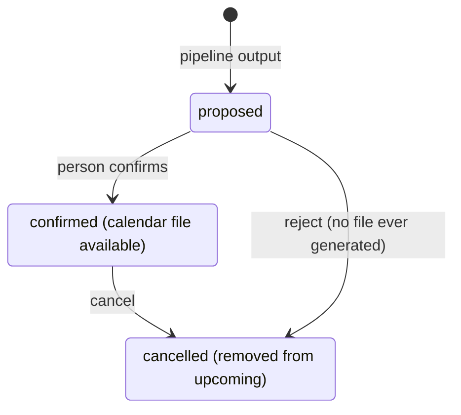
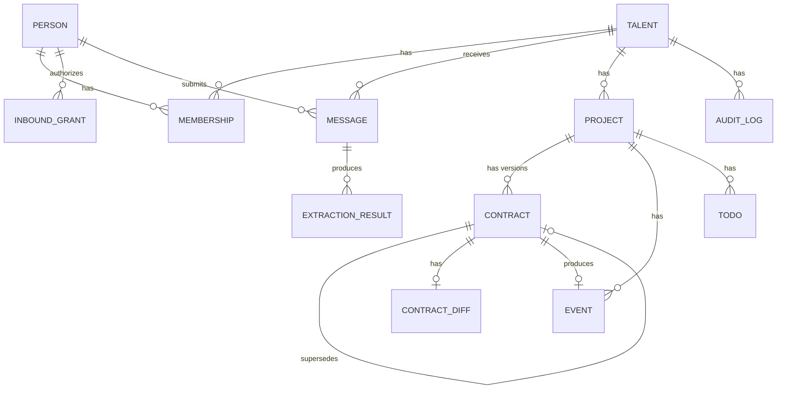

# Architecture

A business operating layer for independent talent: musicians, influencers, models, and the people who manage them. The system ingests the messages a talent's business runs on — gig offers, brand deals, contracts, payment terms — reads what they say, tracks each ongoing deal as one thing even as it evolves across multiple messages and contract versions, and surfaces a dashboard of what's active, what's next, and what needs a decision.

The core mechanism is the same regardless of who's using it: a message comes in, the system reads it, proposes what it means, and a person confirms before anything is recorded as fact or written to a calendar. Everything below exists to support that loop reliably across many message types, many deals, and eventually many kinds of talent.

Scope here is grounded in interviews with two real prospective users — a talent manager and an independent creator — not just assumption. Where their stated needs shaped what's here, it's noted inline.

## Table of contents

- [Functionality](#functionality)
- [Roles and verticals](#roles-and-verticals)
- [Ingestion](#ingestion)
- [Understanding and deal matching](#understanding-and-deal-matching)
- [Pipeline](#pipeline)
- [Entity model](#entity-model)
- [Schema](#schema)
- [Stack](#stack)
- [Splitting the monolith later](#splitting-the-monolith-later)
- [Open questions](#open-questions)

## Functionality

Tagged by when it's built: **MVP** ships first. **Phase 2** follows once the core loop is validated. **Later** is designed for here but not built yet.

### Onboarding and identity

- Sign up and choose a vertical: music artist, influencer, model, or other — **MVP**. Only music is populated with real extraction fields at first; the choice itself, and the framework behind it, ships from day one.
- Choose account type: an individual managing their own career — **MVP**, or a manager/agency managing several talents — **Later**.
- Dashboard labels and extraction fields tailored to the chosen vertical — **Phase 2**. Needs real data from a second vertical first.

### Ingestion

- Gmail add-on: open an email in Gmail, click one button to send just that message in — **MVP**.
- Upload a screenshot, photo, or PDF from a browser, including several images from one scrolling conversation — **MVP**.
- Email a screenshot to a personal upload address as a phone-friendly alternative to the web upload page — **MVP**.
- Forward an email to a dedicated inbound address — **MVP alternative path**. Needs no Google authorization or review at all, and works with any email provider, not just Gmail. Weaker on two fronts: forwarding changes the message headers, so recovering the original sender and timestamp for deal-matching is less reliable than reading via API, and there's no natural UI slot for project tagging the way the add-on's dropdown provides.
- Connect a Gmail account directly so the system reads new mail on its own, no per-message action needed — **Later**. Real access to the whole mailbox, designed for now, built when the per-message flow proves too much friction.
- Other email providers via forwarding — **Later**.

### Reading and understanding

- Classify each message: gig or event offer, contract, payment note, or other — **MVP**.
- Extract the core facts: counterparty, what it's about, date, money, payment method, reply-by deadline — **MVP**.
- Read screenshots and photos as conversations, not single documents — who said what, in what order — **MVP**.
- Read PDF and image attachments, such as a contract or a rider — **MVP**.
- Show contract terms as stated, without judging them — **MVP**.
- Vertical-specific fields — usage rights and exclusivity windows for a brand deal, guarantee versus door split for a music gig — **Phase 2**.
- Guidance on contract language, royalty structures, or red flags — **Later**. Needs a legal or rights specialist involved before it's built at all.

### Deals, not messages

- Group the messages and contract versions that belong to one ongoing deal into a single project — **MVP**.
- Match a new message to an existing project automatically, and always ask the person to confirm the match — **MVP**.
- Detect that a new message is an updated version of an existing contract, and show exactly what changed — fee, dates, terms — **MVP**.
- Manually merge or split projects when the automatic match is wrong — **MVP**, basic version; refined once real usage shows where it fails.

### Quoting and drafting

- Draft a reply, quote, or payment follow-up — several versions at once — for the person to review and send themselves — **MVP**. Validated as the single most requested capability in interviews; the system never sends on its own.
- Toggle a quote between tax-inclusive and tax-exclusive amounts — **Phase 2**.
- Draft against the person's own past phrasing and process, not a generic template — **Phase 2**. Needs enough confirmed history per person to draw from.

### Review and action

- A review queue — nothing is recorded as fact, drafted, or scheduled without a person confirming it — **MVP**.
- A downloadable calendar file for a confirmed event — **MVP**.
- To-dos generated from extracted deadlines: reply by Friday, deposit due Oct 1, review this changed contract — **MVP**.
- Direct calendar account connection, so confirmed events appear without a download step — **Phase 2**.

### Billing and payments

- Track a deal's payment status against extracted amounts and due dates — deposit paid, balance outstanding, overdue — **MVP**. This is a to-do generated from data extraction already in scope, not new infrastructure.
- A running record of which counterparties pay late and by how much — **Later**. Needs enough payment history per counterparty to be meaningful.

### Analytics and insights

- Income breakdown by source — gigs, brand deals, licensing — **Later**.
- Streaming or platform performance data (e.g. Spotify) alongside deal and release activity — **Later**. A separate data integration, not derived from messages.
- Basic bookkeeping and profit/loss summaries — **Later**. Explicitly excluded from MVP; this is accounting software, not a lighter version of it.
- Return on a deal or a piece of content — income against production and promotion cost — **Later**.

### Dashboard

- A list of projects: counterparty, status, next key date — **MVP**.
- Per-project detail: the timeline of messages and versions, current terms, open to-dos — **MVP**.
- Concrete urgency signals validated in interviews: expected income in the next 30 days, deliverables and signatures pending, a contract that doesn't match its offer, unconfirmed travel or venue logistics, overdue payments — **MVP**.
- A single view across every talent a manager or agency represents — **Later**.

### Accounts, access, and security

- Every connected account shows what it will read and do before the person approves it, and can be disconnected at any time, stopping all further access — **MVP**.
- Message content sent to the model is never used to train it, and is handled through the API's standard abuse-monitoring retention, not stored by us beyond what's needed to serve the product — **MVP**.
- Field-level masking and finer access control for sensitive financial data, once serving larger agencies with data they consider confidential — **Later**.

### Bands and collaboration

- Shared access for a band or team, with scoped roles for a session player, lawyer, or bookkeeper — **Later**.

## Roles and verticals

Vertical and account type are independent axes, set separately at onboarding. A manager can represent talents across different verticals; a solo model and a solo musician use the same account type with different extraction fields.

| Axis | Values | What it changes |
|---|---|---|
| Vertical | Music artist, influencer, model, other | Which extraction fields apply beyond the core set, and which labels the dashboard uses |
| Account type | Individual, manager, agency | Whether one `Talent` or many are attached to the person's account, and who can see what |

Every extraction schema starts from the same core: who the counterparty is, what the message is about, when, how much money, how it's paid, and any reply-by deadline. A vertical adds fields on top of that core rather than replacing it — a brand deal still has a date and a payment, it also has deliverables and a usage window.

## Ingestion

The first version never scans a mailbox in the background. Every message arrives because a person acted: they clicked a button on an email they had open, forwarded a message, or uploaded a file. That has a real engineering upside — there's no unknown-sender case to guard against, because the source of every message is always the authenticated person themselves, not a claim in an email header.

### Gmail add-on

- A Google Workspace Add-on registers a contextual card in Gmail. While a person has a message open, the card shows a button to send it in.
- Clicking it calls our HTTP endpoint with the open message's id and an authorization scoped to that message only — not the mailbox.
- Our backend calls the Gmail API with that authorization to fetch the one message — body and attachments — and hands it to the same pipeline an upload would go through.
- Authorization happens once, at add-on install, and is stored as one row per person. No polling, no watch subscription, no background job.
- Before sending, the card can show a dropdown of the user's existing projects (plus an option to create a new one), so the message is filed under the right deal on the way in. This removes a meaningful chunk of the deal-matching problem for anything that comes through this channel — the person is telling the system directly, rather than the system inferring it.

> **Confirm before building:** as I understand it, a Gmail add-on scoped to the current message sits in a lighter review tier than full mailbox access, but Google's review requirements shift — check the current Workspace Add-ons documentation before committing engineering time to the submission process.

### Email forwarding

- A person forwards a relevant email to a dedicated address (e.g. `you@in.talentbusinessos.com`), or sets up a one-time auto-forward rule in Gmail so future mail forwards automatically.
- Needs no Google authorization or review at all, and works with any email provider — the mechanism is just "the user sends mail to an address we control."
- Forwarding rewrites the message: the original sender and timestamp end up embedded in the forwarded body rather than in clean headers, so recovering them for deduplication and deal-matching needs extra parsing and is less reliable than reading the original via an API.
- No native UI for project tagging — would need a convention (e.g. a tag in the subject line) or a follow-up step on a web page.

### Screenshots and uploads

- A web upload page takes screenshots, photos, and PDFs — drag and drop on desktop, file picker or camera roll on mobile. Files go straight to blob storage through a presigned URL, then a short call registers the upload as a message.
- Several images uploaded together are treated as one conversation. The extractor reads them in the order they were uploaded and reconstructs who said what.
- A personal email-in address covers the case where uploading from a phone's share sheet isn't available.
- Relative dates in a screenshot ("Friday," "tomorrow") resolve against a timestamp visible in the image where there is one, falling back to upload time. The review screen always shows the resolved date, not the original phrase.

### Designed for later: a connected mailbox

- Gmail API and Microsoft Graph over OAuth 2.0, one refresh token per mailbox. Poll on an interval to start; push (a Gmail `watch` on Pub/Sub, or a Graph subscription) once latency matters.
- This is a materially bigger authorization to ask for — the full mailbox, not one message — and past a small number of users it needs Google's app verification and a security assessment, which can take weeks.
- It also reopens a problem the per-message design avoids: a connected mailbox can receive mail addressed to more than one project or, for a manager, more than one talent, so it needs a routing step the add-on flow doesn't.
- Continuous mailbox monitoring (polling or a maintained push subscription) is a standing background cost that runs even when nothing's happening, scaling with total user count — a real, durable difference from the add-on's zero-idle-cost model.

> **Message content is untrusted input regardless of channel.** The extractor returns schema-validated data and has no tools of its own, so nothing inside a message can trigger an action by itself. Every write — a confirmed event, a saved contract — happens only after a person confirms it in the review queue.

## Understanding and deal matching

Extraction turns a message into facts. Matching decides which ongoing deal those facts belong to. These are separate steps, and the second one is the harder engineering problem.

### Extraction

- A classifier call labels the message type. An extractor call — forced into a schema, not free text — pulls out the core fields, plus vertical fields once those exist.
- Images (screenshots, photos, rendered PDF pages) go through the same extractor using a vision-capable model call rather than a separate OCR step.
- Every extraction is stored with the model version and a confidence score, versioned per message rather than overwritten — re-running extraction later doesn't lose the earlier attempt.

### Matching a message to a project

A deal is rarely one message. A venue's first offer, the signed contract, and a follow-up about the deposit date are the same deal told three times. The system needs to recognize that without ever silently merging two unrelated deals with the same counterparty.

- **Explicit tagging first.** If the message arrived through a channel that lets the person specify the project directly (e.g. the Gmail add-on's dropdown), use that — no inference needed.
- **Email threading next.** When a message is a reply within an existing email thread, the link is free and certain.
- **Similarity as a fallback.** For anything without a thread or an explicit tag — a new email, a screenshot of a different app — compare the extracted summary against the open projects for that talent using embedding similarity, and propose the closest match above a threshold.
- **Always proposed, never automatic** for anything inferred. A proposed match is presented as "this looks like the same deal as [project] — is it?" alongside the extraction review, and a person confirms, rejects, or starts a new project instead.

### Versioning and diffing

- When a message is confirmed as part of an existing project and it's a contract, it becomes a new version linked to the one it replaces.
- The diff is computed over the structured fields, not the raw document — "fee changed from $500 to $650," "deposit deadline moved from Oct 1 to Oct 15" — because that's what a person needs to see at a glance. The raw attachments for both versions stay available underneath.

### Drafting

A drafter call sits alongside the classifier and extractor, not inside them. Given a project's confirmed history and the message that prompted it, it produces several candidate replies, quotes, or payment follow-ups. It writes nothing anywhere and sends nothing — its output is text on the review screen, and only a person's own send action leaves the system.

## Pipeline

Every arrow below is a data contract, not just a connection.


Ingestion only happens when a person acts, so every message has a known, authenticated source — there's no sender-identity check to perform. The deal matcher runs before anything is written, so a proposed project link is confirmed by the person alongside the extracted facts, not merged silently.

### Event lifecycle

Without a direct calendar connection, "cancelling" an event here can't reach into a calendar app and remove a file already handed over — it only stops the system from treating it as upcoming.



A rejected proposal never generates a file. A cancelled confirmed event only stops appearing as upcoming here — the `.ics` file already downloaded isn't reachable to remove.

## Entity model

`Membership` makes manager and agency accounts a permissions problem rather than a schema problem — even though only the `owner` role is created automatically for now. `Project` and `Contract` together are what let a deal be tracked as one thing across several messages and versions.



| From | To | Cardinality | Via |
|---|---|---|---|
| Person | Talent | N—M | `Membership` (role) |
| Person | InboundGrant | 1—N | `person_id` |
| Talent | Message | 1—N | `talent_id` |
| Talent | Project | 1—N | `talent_id` |
| Message | ExtractionResult | 1—N | `message_id` — versioned, latest wins |
| Project | Contract | 1—N | `project_id` — each row is one version |
| Contract | Contract | 0/1—0/1 | `supersedes_id` — the version it replaces |
| Contract | ContractDiff | 1—0/1 | `contract_id` — present from version 2 onward |
| Contract | Event | 1—0/1 | `event.contract_id` |
| Project | Todo | 1—N | `project_id` |
| Talent | AuditLog | 1—N | `talent_id` |

Full field-level detail lives in the schema below — the DDL is the authoritative reference, not duplicated here.

## Schema

Raw payloads live in blob storage, never inlined in a row. `message.raw_payload_uri` is a pointer.

```sql
create table person (
  id            uuid primary key default gen_random_uuid(),
  email         citext unique not null,
  display_name  text not null,
  created_at    timestamptz not null default now()
);

create table talent (
  id          uuid primary key default gen_random_uuid(),
  name        text not null,
  vertical    text not null check (vertical in ('music','influencer','model','other')),
  created_at  timestamptz not null default now()
);

create table membership (
  id          uuid primary key default gen_random_uuid(),
  talent_id   uuid not null references talent(id),
  person_id   uuid not null references person(id),
  role        text not null default 'owner'
                check (role in ('owner','manager','agency_admin')),
  status      text not null default 'active'
                check (status in ('invited','active','revoked')),
  created_at  timestamptz not null default now(),
  unique (talent_id, person_id)
);

create table inbound_grant (
  id             uuid primary key default gen_random_uuid(),
  person_id      uuid not null references person(id),
  provider       text not null check (provider in ('gmail')),
  scope_tier     text not null
                   check (scope_tier in ('addon_current_message','full_mailbox')),
  refresh_token  bytea,        -- present only for full_mailbox, encrypted at rest
  status         text not null default 'active'
                   check (status in ('active','revoked','error')),
  created_at     timestamptz not null default now()
);

create table message (
  id               uuid primary key default gen_random_uuid(),
  talent_id        uuid not null references talent(id),
  submitted_by     uuid not null references person(id),  -- always the authenticated user
  channel          text not null check (channel in ('gmail_addon','upload','forwarded_email')),
  external_ref     text,                                  -- Gmail message id, when channel = gmail_addon
  received_at      timestamptz not null,
  raw_payload_uri  text not null,                          -- pointer into blob storage
  origin_hint      text,                                   -- model's guess for uploads: 'instagram', 'sms'...; never trusted
  dedup_key        text not null,                          -- gmail_addon: the Message-ID header
                                                            -- upload: sha256(file bytes)
                                                            -- forwarded_email: sha256(unwrapped original sender + sent time + body)
  status           text not null default 'pending'
                     check (status in ('pending','classified','processed','error')),
  created_at       timestamptz not null default now(),
  unique (dedup_key, talent_id)
);
create index message_talent_status_idx on message (talent_id, status);

create table extraction_result (
  id            uuid primary key default gen_random_uuid(),
  message_id    uuid not null references message(id),
  message_type  text not null
                  check (message_type in ('gig_offer','contract','payment_note','other')),
  extracted     jsonb not null,      -- core fields + vertical extension, schema-validated
  confidence    numeric(4,3) not null,
  model_version text not null,
  created_at    timestamptz not null default now()
);

create table project (
  id           uuid primary key default gen_random_uuid(),
  talent_id    uuid not null references talent(id),
  counterparty text not null,
  project_type text not null check (project_type in ('booking','brand_deal','publishing','other')),
  status       text not null default 'open' check (status in ('open','closed')),
  created_at   timestamptz not null default now()
);

create table contract (
  id              uuid primary key default gen_random_uuid(),
  project_id      uuid not null references project(id),
  message_id      uuid references message(id),
  version_number  int not null default 1,
  supersedes_id   uuid references contract(id),
  contract_type   text not null
                    check (contract_type in ('booking','recording','publishing','sync','brand_deal')),
  terms           jsonb not null,
  status          text not null default 'draft' check (status in ('draft','confirmed','void')),
  created_at      timestamptz not null default now(),
  unique (project_id, version_number)
);

create table contract_diff (
  id           uuid primary key default gen_random_uuid(),
  contract_id  uuid not null references contract(id),   -- the newer version
  diff         jsonb not null,        -- [{ field, before, after }, ...]
  created_at   timestamptz not null default now()
);

create table event (
  id          uuid primary key default gen_random_uuid(),
  project_id  uuid not null references project(id),
  contract_id uuid references contract(id),
  title       text not null,
  venue       text,
  start_at    timestamptz not null,
  end_at      timestamptz,
  status      text not null default 'proposed'
                check (status in ('proposed','confirmed','cancelled')),
  created_at  timestamptz not null default now()
);

create table todo (
  id                 uuid primary key default gen_random_uuid(),
  project_id         uuid not null references project(id),
  talent_id          uuid not null references talent(id),
  type               text not null
                        check (type in ('respond_to_offer','review_contract_change','confirm_event',
                                        'payment_due','payment_overdue','confirm_logistics','custom')),
  title              text not null,
  due_at             timestamptz,
  status             text not null default 'open' check (status in ('open','done','dismissed')),
  source_message_id  uuid references message(id),
  created_at         timestamptz not null default now()
);

create table audit_log (
  id               uuid primary key default gen_random_uuid(),
  talent_id        uuid not null references talent(id),
  actor_person_id  uuid not null references person(id),
  action           text not null,     -- e.g. 'event.confirmed', 'project.linked'
  target_type      text not null,
  target_id        uuid not null,
  created_at       timestamptz not null default now()
);
```

## Stack

Opinionated defaults, not mandates.

| Layer | Choice | Why |
|---|---|---|
| Frontend | Next.js (React, TS) | One language across the stack; suits a review-queue-and-dashboard app |
| Backend / API | Same Next.js app *(open)* | Single deployable to start; split out a worker service if the pipeline outgrows it |
| LLM | Claude API | Structured JSON extraction, vision input for screenshots and PDF pages, embeddings for deal matching |
| Primary DB | Postgres | Relational integrity matters once money, contracts, and versions are involved |
| Vector search | pgvector | Used now for deal matching; avoids a second datastore |
| Job queue | pg-boss / graphile-worker | Postgres-backed, no extra infra to start |
| Blob storage | S3 (or GCS) | Raw emails, screenshots, PDFs; presigned uploads straight from the browser |
| Gmail ingestion | Google Workspace Add-on | Per-message, user-initiated, narrower authorization than full mailbox access |
| Calendar output | Generated `.ics` file | No calendar account connection, no stored tokens |
| App auth (login) | Clerk / NextAuth | Login only — separate from any mailbox authorization |
| Hosting | Fly.io / Render *(open)* | Fast to ship, low ops; move to AWS/GCP if more control is needed |

### Designed for, not built yet

- **Full mailbox connection** — Gmail API and Microsoft Graph over OAuth, poll then push. Built if the per-message add-on flow proves too much friction.
- **Direct calendar connection** — Google Calendar API / Microsoft Graph Calendar, once a person wants events to appear without a download step.
- **Other email providers** — inbound email parsing (Postmark / SendGrid Inbound Parse) for forwarding on non-Gmail accounts.

## Splitting the monolith later

The pipeline already creates the seam this would use: ingestion, classification, extraction, matching, and orchestration talk to each other only through the message queue and Postgres, never through direct function calls. That means the hard part of drawing service boundaries is a design decision already made, not a rewrite to do later.

- **Frontend / backend split first.** Move the API route handlers into a standalone service with its own domain and deploy. This mainly means configuring CORS, switching session cookies to a cross-origin auth strategy (bearer tokens, or cross-origin cookie settings), and writing down an explicit API contract (OpenAPI, or a shared types package) to replace the type-sharing a single Next.js app gives for free.
- **Backend into services second.** The queue consumer (classifier → extractor → matcher → orchestrator) is the natural first extraction — it already reads and writes only through the queue and the database, so making it run as its own deployed process is mostly a matter of how it starts, not a logic change. The Gmail add-on's webhook is the next candidate, since Google enforces tight response-time limits on it and it shouldn't be blocked by unrelated load.
- **What actually gets harder.** Failure handling changes from "the whole operation failed" to "one stage succeeded and the next one hasn't run yet" — the existing `dedup_key` uniqueness is what keeps retries safe, but every new service boundary needs the same idempotency discipline. Tracing a single message across services needs a shared id carried through every log line. Local development needs all the services running at once (Docker Compose or similar) instead of one `npm run dev`.

> **Don't split preemptively.** The cost of separate services is operational — more deployments, more monitoring, more moving parts to run locally — not a logic cost, since the queue already isolates the logic. Do it when there's a concrete forcing reason: one stage needs to scale independently under real load, a second engineer wants an independently deployable area of ownership, or one piece genuinely needs a different runtime. Before that, it's paying the operational cost early for no benefit yet.

## Open questions

- **Add-on review requirements.** Confirm the current scope tier and review process for a Gmail contextual add-on before building it.
- **Matching threshold.** What similarity score proposes a link versus starts a new project — needs real messages to set, not a guess.
- **Diffing nested fields.** A changed date or fee is a simple field diff. A changed list — one more tour date added, one deliverable removed from a brand deal — needs its own diff strategy.
- **Vertical schema fields.** Can't finalize the influencer or model extension schema without real sample deals from each — same research dependency as the extraction schema itself.
- **Manager visibility boundary.** Once a manager account exists, do they see raw source messages or only extracted summaries? Worth deciding before building multi-talent accounts, since it shapes the Membership and Message access rules.
- **Screenshot and forwarded-mail retention.** Both can contain a counterparty's private content. How long originals are kept, and whether anything gets redacted, is still open.
