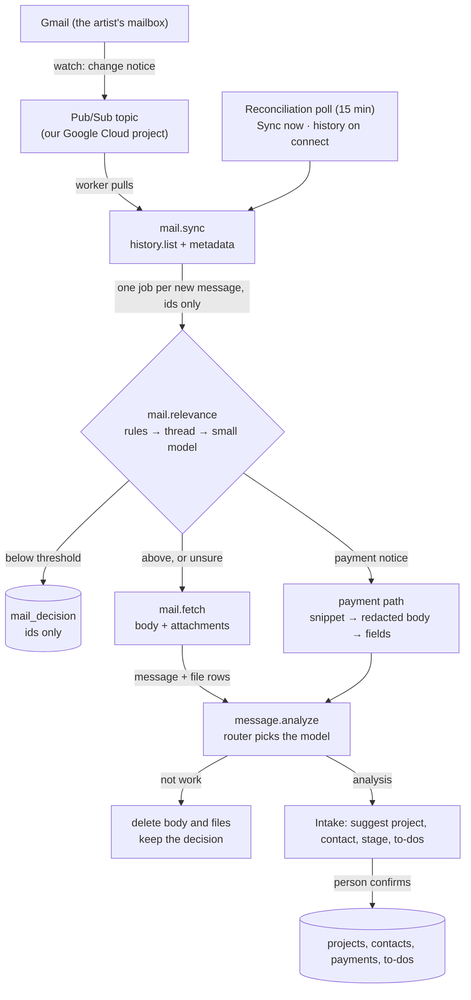

# Design: ingesting the connected Gmail mailbox

**Status:** Agreed direction (2026-10-10). The decisions behind it: [0013](../decisions/0013-connected-gmail-mailbox.md) (what is read and kept), [0014](../decisions/0014-hosting-and-job-queue.md) (hosting and the queue), [0015](../decisions/0015-production-model-providers.md) (models), [0016](../decisions/0016-mailbox-tokens-and-key-management.md) (tokens). Diagrams (private; open them from the owner's account or share them from their pages): [Message Pipeline Map](https://claude.ai/artifact/Av5sq9yns69tX39BFfdiQg), the whole path from paste, upload, and Gmail to a confirmed change, by system; [Gmail Token Flow](https://claude.ai/artifact/2Moj4sPrnpJxh1Uc2r4kVg), how the token is issued, used, and refreshed.

## The point

Most of what happens after an email arrives already exists: analysis (`lib/ai/analyze-message.ts`), suggesting a project (`suggestTargets` in `lib/domain/intake.ts`), the per-intent proposals, and the review screen ([intake-to-project](intake-to-project.md)). This design adds what comes before: connecting a mailbox, noticing new mail, deciding what's work from metadata alone, and fetching only that. An email that passes becomes a `message` like a paste or an upload, and the person confirms everything it proposes.

## Pipeline

Every box after Pub/Sub is a job in the worker (decision 0014); arrows carry ids, never content. One named queue per mailbox keeps one connection's jobs in order.

## Modules

| Path | What it holds | Imports `next/*` |
|---|---|---|
| `lib/queue/` | The `Queue` interface (`enqueue(name, payload, { tx?, queueName?, jobKey?, runAt? })`) and its Graphile Worker implementation | No |
| `worker/index.ts` | Starts Graphile Worker with the task list and crontab; `npm run worker` | No |
| `lib/keys/` | `KeyProvider`: wrap and unwrap a data key; `.env` and Cloud KMS implementations; AES-256-GCM helpers | No |
| `lib/mail/provider.ts` | The `MailProvider` interface: `listChanges(cursor)`, `getMetadata(id)`, `getMessage(id)`, `getAttachment(id)`, `watch()`, `stopWatch()`, `revoke()` | No |
| `lib/mail/gmail/` | The Gmail implementation with plain `fetch` (like `lib/calendar/google/api.ts`); an overridable base URL for a fake in tests | No |
| `lib/mail/relevance/` | Rules (pure, tested), thread memory, the model step, thresholds | No |
| `lib/mail/clean.ts` | HTML to text, quoted history and signature stripping, payment redaction (pure, tested) | No |
| `lib/mail/jobs/` | Task handlers: `sync`, `relevance`, `fetch`, `watch-renew`, `reconcile`, `history`, `expire`, `disconnect` | No |
| `lib/ai/` | The router (`relevance`, `analysis`, `analysis_complex`), the OpenAI and Anthropic adapters, the free-tier guard | No |
| `app/api/mail/connect`, `app/api/mail/callback` | The OAuth start (state + PKCE) and callback | Yes (thin) |
| `lib/actions/mail.ts` | Sync now, disconnect, Not work, This was work, sender rules | Yes (thin) |

## Data

All new tables are scoped to `talent_id` and checked against the signed-in person's membership, like every query for a talent's data.

**`mail_connection`**: one connected mailbox for a talent.

| Column | Notes |
|---|---|
| `talent_id`, `connected_by` (person) | Whose account it feeds, who connected it |
| `provider` | `gmail` (provider-neutral table, as `calendar_connection` is) |
| `account_email`, `account_subject` | The Google account: its address and Google user id |
| `scopes` | What was granted |
| `refresh_token_ciphertext`, `refresh_token_nonce`, `refresh_token_tag` | AES-256-GCM (decision 0016) |
| `data_key_wrapped`, `key_id` | The data key wrapped by the KMS master key, and which key and version |
| `history_id`, `watch_expires_at` | Sync cursor and watch renewal |
| `history_mode`, `history_done_at` | `30_days` or `new_only`; when the history read finished |
| `status`, `failure`, `last_synced_at` | `connected`, `reconnect_needed`, `error` |

**`mail_decision`**: one row per message the relevance check saw, ids only (decision 0013).

| Column | Notes |
|---|---|
| `connection_id`, `provider_message_id`, `provider_thread_id` | Unique on (connection, message): never evaluated twice per classifier version |
| `received_at`, `score`, `decided_by` | `rule:<id>`, `thread`, `model`, `person` |
| `outcome` | `skipped`, `brought_in`, `unsure`, `payment`, `not_work` |
| `classifier_version` | Rules version + prompt fingerprint + model |
| `message_id` | The `message` it became, if any |

**`mail_sender_rule`**: an artist's "always" or "never" for a sender or domain, created only by their action.

**`message`, new columns**: channel `gmail` added; `connection_id`; `provider_thread_id`; `header_message_id`, `in_reply_to`, `references` (for threading); `direction` (`received` or `sent`); `relevance` (`sure` or `unsure`). `external_ref` keeps the Gmail message id; `dedup_key` for Gmail is `gmail:<connection>:<message id>`.

**Payment notices** keep their fields in the analysis and no `body_text` or files; an unmatched one carries an `expires_at`.

## Jobs

| Job | Triggered by | Queue | Does |
|---|---|---|---|
| `mail.sync` | Pub/Sub notice, poll, Sync now | `mail:<connection>` | `history.list` from the cursor; `messages.get(format=metadata)`; enqueue `mail.relevance` per new message; advance the cursor in the same transaction |
| `mail.relevance` | `mail.sync`, `mail.history` | `mail:<connection>` | Rules → thread memory → small model; write `mail_decision`; enqueue `mail.fetch` or the payment path |
| `mail.fetch` | `mail.relevance` | `mail:<connection>` | Body and attachments into `message` and `file`; enqueue `message.analyze` |
| `message.analyze` | `mail.fetch`, paste, upload | per talent | The existing analysis, model picked by the router; not-work cleanup |
| `mail.history` | Connect | `mail-history` (low priority) | The last 30 days, through the same relevance path |
| `mail.watch-renew` | Daily cron | — | Renew each connection's Gmail watch |
| `mail.reconcile` | Every 15 minutes | — | Enqueue `mail.sync` for each connection |
| `mail.expire` | Daily cron | — | Delete unmatched payment fields past `expires_at` |
| `mail.disconnect` | Disconnect | `mail:<connection>` | Stop watch, revoke, delete per the artist's choice |
| `calendar.sync` | Event changes, Sync now | per connection | Today's Calendar push, with the retries from the launch checklist |

## Intake

- **Gmail messages** look like any other message, with the sender, subject, and a link to open the email in Gmail.
- **Flags**: "Not sure this is work" (unsure band), "Payment not matched to any project" (unmatched payment), each with its one-click answer.
- **From your history**: threads from the history read whose last message is more than 14 days old, grouped and collapsed.
- **Filtered out**: a filter listing skipped emails, fetched live from Gmail (metadata only); **This was work** brings one in.
- **Not work** on any Gmail message: deletes its body and files, keeps the decision, offers "never from this sender".

## Settings

- **Connect Gmail**: any Google account; says what's read, what's kept, that members (including a manager) see work email brought in, and, when `AI_FREE_TIER_OK=1`, that Google's free tier analyzes it. History choice: last 30 days (default) or only new mail.
- **Connected**: account, status, last sync, Sync now, sender rules.
- **Disconnect**: remove everything brought in from Gmail, or keep what's filed under projects and remove the rest.

## Configuration

| Variable | Purpose |
|---|---|
| `APP_ENV` | `development`, `testing`, `production`; gates the free tier and the `.env` key |
| `AI_PRIMARY`, `AI_BACKUP` | `anthropic` or `openai` |
| `ANTHROPIC_API_KEY`, `OPENAI_API_KEY` | Provider keys |
| `AI_MODEL_<PROVIDER>_<ROLE>` | e.g. `AI_MODEL_ANTHROPIC_RELEVANCE`; roles `RELEVANCE`, `ANALYSIS`, `ANALYSIS_COMPLEX` |
| `AI_FREE_TIER_OK` | Allows Gmail content to reach a provider marked `AI_PROVIDER_KEEPS_DATA` (never with `APP_ENV=production`) |
| `MAIL_RELEVANCE_HIGH`, `MAIL_RELEVANCE_LOW` | The two thresholds |
| `MAIL_KEY_DEV` | The local data-key master key (development only) |
| `GCP_PROJECT`, `KMS_KEY_NAME`, `GCP_KMS_CREDENTIALS` | Cloud KMS (encrypt-only credential on web, decrypt-only on the worker) |
| `PUBSUB_TOPIC`, `PUBSUB_SUBSCRIPTION`, `GCP_PUBSUB_CREDENTIALS` | Gmail notices (worker only) |
| `GMAIL_API_URL`, `GOOGLE_OAUTH_TOKEN_URL` | Overridden to fakes in tests |

## Testing

- Pure functions with unit tests: rules, thread memory, cleaning and redaction, the router, the payment matcher, thresholds.
- A fake Gmail API and fake Pub/Sub and KMS for end-to-end tests, as Calendar uses a fake Calendar API; never a real mailbox in CI.
- The relevance eval (`evals/`): made-up emails with known answers, at least half Traditional Chinese, scored for recall first; run on every model named in configuration.
- Recorded model responses (`AI_REPLAY`) cover the new roles.

## Build order

One theme per branch, each mergeable on its own and testable on the builder's own inbox.

| # | Branch | Adds | After it |
|---|---|---|---|
| 0 | `gmail-ingestion-design` | These decisions and this design | Review |
| 1 | `job-queue-worker` | Graphile Worker behind `Queue`; `npm run worker`; analysis off `after()` | Pastes and uploads analyzed by the worker |
| 2 | `gmail-connect` | `mail_connection`, the OAuth flow, `KeyProvider` (`.env`), `APP_ENV`; connect and disconnect in Settings | Connect and disconnect your own Gmail |
| 3 | `gmail-sync-rules` | `MailProvider`, Sync now (metadata only), `mail_decision`, rules, thread memory, Filtered out | See what the rules decide, no body read |
| 4 | `relevance-model` | Router and roles in configuration, the free-tier guard, the model step, thresholds, relevance eval | Every email scored; tune the thresholds |
| 5 | `gmail-ingest` | Fetch into `message` and `file`, thread headers, analysis via the queue, Not work and cleanup | Real work email in Intake, analyzed |
| 6 | `payment-notices` | The restricted path, the unmatched payment card, expiry | Bank notices matched to payments |
| 7 | `gmail-threads` | Thread as the top suggestion, sent mail in relevant threads, contact proposals, reply to-do completion | A negotiation tracked as one project |
| 8 | `gmail-push-backfill` | Watch + Pub/Sub pull, renewal, reconciliation, history on connect | Mail arrives without Sync now |
| 9 | `ai-providers` | OpenAI and Anthropic adapters; evals on both | Paid models; required before anyone else's mail (can move up to right after 4) |
| 10 | `deploy-render` | `Dockerfile`, `render.yaml`, Cloud KMS provider, Supabase project, Google Cloud setup | The first person besides the builder connects |

**Alongside**: start Google verification once branch 2 works (privacy policy, verified domain, scope reasons, demo video), then CASA preparation.

## Open questions

1. **Threshold starting values.** Set from the first relevance eval run, not guessed.
2. **Rules data.** The first list of e-sign and booking-platform senders, and work keywords in both languages.
3. **"Never from this sender" for a contact.** Does a "never" rule override the contact rule?
4. **The add-on after this.** It reuses the same fetch and analysis; its project dropdown becomes the strongest target signal.
